> The command-line companion to Wireshark. Same engine, same dissectors, same display-filter syntax — but scriptable, pipeable, and ready for asset-inventory pipelines.
> Each section includes things to try and how to verify them. Add screenshots / terminal captures under the relevant headings as you complete the exercises.


# Table of Contents

1. [Setup Recap and First Sanity Checks](#1-setup-recap-and-first-sanity-checks)
2. [What tshark Is and When to Use It](#2-what-tshark-is-and-when-to-use-it)
3. [Anatomy of a tshark Command](#3-anatomy-of-a-tshark-command)
4. [Your First Capture from the Console](#4-your-first-capture-from-the-console)
5. [Understanding the Default Output Columns](#5-understanding-the-default-output-columns)
6. [Reading and Writing pcap Files](#6-reading-and-writing-pcap-files)
7. [How Protocol Layers Show Up on the Command Line](#7-how-protocol-layers-show-up-on-the-command-line)
8. [Capture Filters (`-f`) vs Display Filters (`-Y`)](#8-capture-filters--f-vs-display-filters--y)
9. [Using Display Filter Variables on the Command Line](#9-using-display-filter-variables-on-the-command-line)
10. [Extracting Specific Fields (`-T fields`)](#10-extracting-specific-fields--t-fields)
11. [Following Streams and Conversations from the CLI](#11-following-streams-and-conversations-from-the-cli)
12. [Statistics from the Command Line (`-z`)](#12-statistics-from-the-command-line--z)
13. [Output Formats and Piping](#13-output-formats-and-piping)
14. [Long-Running Captures, Rotation, and Ring Buffers](#14-long-running-captures-rotation-and-ring-buffers)
15. [Common Gotchas on Windows 11 / PowerShell](#15-common-gotchas-on-windows-11--powershell)
16. [Recon-oriented Exercises (Recon-Oriented)](#recon-oriented-exercises)
17. [Cheat Sheet](#cheat-sheet)


# 1. Setup Recap and First Sanity Checks

You already verified:

```powershell
tshark -v        # version banner
tshark -D        # list capture interfaces, note the number of your active adapter
```

First, some important notes:

> 💡 From here on, examples will use **`-i 1`** as a placeholder for your active interface number from `tshark -D`. Substitute whatever number matches your Wi-Fi/Ethernet on your machine.

> 💡 **PowerShell vs cmd:** Every command in this guide works well in both. PowerShell is preferred for output redirection and pipes. If a command behaves oddly with quotes, see [section 15](#15-common-gotchas-on-windows-11--powershell). The only command that differ from Windows to Linux are the ones ending with `| Select-Object -First 5` which is equivalent to `| head -n 5` and similar ones.

> 💡 **Admin or not?** Live capture (`-i`) may require admin depending on how Npcap was installed. Reading existing files (`-r`) never does. If a live command fails with a permission error, retry in an admin PowerShell.


# 2. What tshark is and when to use it

tshark is **the same packet engine as Wireshark, without the GUI**. It does the same three things:

1. **Captures** live packets via Npcap.
2. **Analyzes** them using the identical protocol decoders.
3. **Presents** them but as text: to stdout, to a file or piped into other tools.

**Use Wireshark (GUI) when you want to:**
* Explore a capture interactively, following streams visually, drilling into a single weird packet or learning a new protocol.

**Use tshark (CLI) when you want to:**
- Have repeatable, scriptable output.
- Extract specific fields for an asset inventory.
- Capture on a remote/headless machine.
- Chain captures into a pipeline - parse with PowerShell, `grep`, pipe into a CSV, feed into another tool.
- Have long-running rotating captures without a GUI sitting open.

`tshark` is what can turn pcap files into a **structured recon output** (hostname tables, banner lists, OS guesses) rather than just "screenshots of Wireshark".


# 3. Anatomy of a tshark Command

Every tshark invocation is some combination of these flag categories:

| Flag family | What it controls | Examples |
|---|---|---|
| **Input** | Where packets come from | `-i 1` (live capture), `-r file.pcap` (read an already captured file) |
| **Output** | Where they go | `-w out.pcap` (write file), default is stdout text |
| **Filters** | What gets captured / shown | `-f "tcp port 80"` (**capture filter**), `-Y "http"` (**display filter**) |
| **Limits** | When to stop | `-c 100` (count), `-a duration:60` (autostop seconds) |
| **Format** | How text output looks | `-T fields -e ip.src`, `-T json`, `-V` (verbose), `-x` (hex) |
| **Stats** | Computed summaries | `-z conv,ip`, `-z io,phs`, `-z http,tree` |
| **Behavior** | Misc tweaks | `-n` (no DNS resolution), `-q` (quiet — used with `-z`) |

**Mental model:** `input → filter → format/output`t. Most commands you'll write are just picking one option from each column.


# 4. Your First Capture from the Console

## 4a. Capture 10 packets and print them to the terminal

```powershell
tshark -i 1 -c 10
```

`-c 10` stops after 10 packets. You'll see one line per packet.

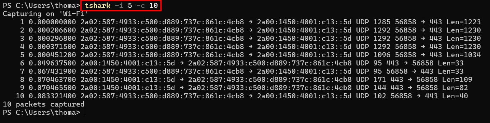

## 4b. Capture for 30 seconds to a file

```powershell
tshark -i 1 -a duration:30 -w first_capture.pcapng
```

`-a duration:30` autostops after 30 seconds; `-w` writes the binary pcap-ng file. The file is the same format Wireshark uses — you can open it in the GUI later.

## 4c. Verification Exercise

```powershell
tshark -r first_capture.pcapng -c 10
```

`-r` reads from the PCAP file. You should see the first 10 packets summarized. 
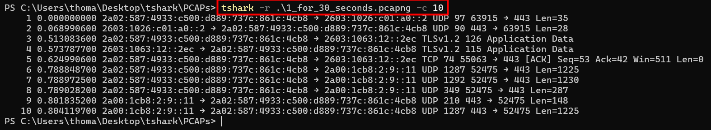


# 5. Understanding the Default Output Columns

The default text output mirrors Wireshark's packet list:

```
    47   2.143521   192.168.1.50 → 142.250.190.46   TLSv1.3   583   Application Data
    ^        ^             ^             ^             ^        ^        ^
    No.     Time         Source       Destination   Protocol  Length   Info
```

| Column | Meaning |
|---|---|
| **No.** | Sequential number within this capture (not a packet property) |
| **Time** | Seconds since capture start by default |
| **Source / Destination** | Best-effort addresses (IP usually, MAC for ARP, etc.) |
| **Protocol** | Highest-layer dissector that succeeded |
| **Length** | Frame size on the wire, in bytes |
| **Info** | Human-readable summary from the highest-layer dissector |

## 5a. Changing what's shown

- `-t a` — absolute time of day instead of seconds-since-start
- `-t ad` — absolute date and time
- `-t d` — delta from previous packet
- `-n` — don't resolve IPs/ports to names (faster, and what you want for raw recon data)
- `-N mntC` — turn on specific name resolutions (m=MAC, n=network/IP, t=transport/port, C=concurrent DNS)

## 5b. Verification Exercise

Add the flag `-t a`. You can also include `-t ad -n` if you want:

```powershell
tshark -r first_capture.pcapng -c 20 -t a
```

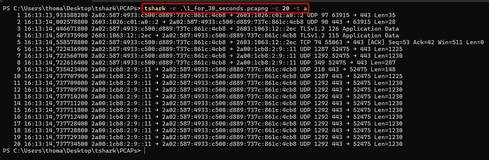


# 6. Reading and Writing pcap Files

| Command | Purpose |
|---|---|
| `tshark -i 1 -w out.pcapng` | Live capture to file |
| `tshark -r in.pcapng` | Read file, print summaries |
| `tshark -r in.pcapng -w out.pcapng -Y "http"` | Read in, filter, write subset to new file |
| `tshark -r in.pcapng -c 100` | Read only first 100 packets |
| `tshark -r in.pcapng -2 -R "tcp.port == 443"` | Two-pass read with the `-R` "read filter" (needed for some analysis that requires the full picture before filtering) |

> 💡 **`.pcapng` vs `.pcap`:** `.pcapng` is the modern default and **supports per-packet metadata**; older tools sometimes only read `.pcap`. Both work in Wireshark/tshark. Use `.pcap` for compatibility, `.pcapng` otherwise.

## 6a. Use `rYw` to fitler DNS messages

Capture 30s to a file, then re-read it with a filter to trim to just DNS:

```powershell
tshark -i 1 -a duration:30 -w full.pcapng
tshark -r full.pcapng -Y "dns" -w dns_only.pcapng
tshark -r tls_only.pcapng -c 5
```

You should now have two files; the second one is much smaller and **only contains DNS messages**.

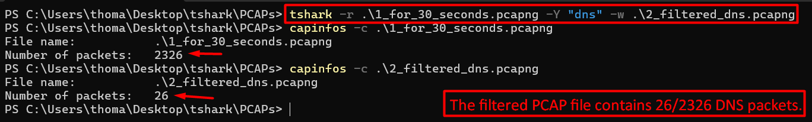

## 6b. Use `rYw` to fitler TLS `Client Hello` messages

Let's apply the `Client Hello` filter `tls.handshake.type == 1`:
```
tshark -r full.pcapng -Y "tls.handshake.type == 1" -w client_hello.pcapng
```

The filtered PCAP output `client_hello.pcapng` still has the correct Bytes for the filtered packets, however, some inaccuracies may occur. For example, **the original `TLSv1.3` protocol may be identified as `TLSv1.2` and some `Client Hello` or `Change Cipher` TLS messages may be interpreted falsely** giving an `INFO` field like this: `Ignored Unknown Record`.

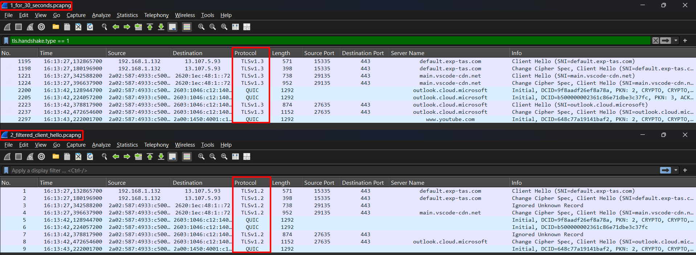

> ❓ Why this happens?

**When Wireshark dissects TLS, it doesn't treat each packet independently**. It tracks each TCP connection as a state machine:

1. At first, it sees the 3-way TCP handshake (**SYN, SYN-ACK and ACK**) and understands that there is a TCP stream.
2. Afterwards, it sees a `Client Hello` on that stream, so it marks the stream as `"this is TLS, and we negotiated version X"`.
3. **Later packets on that stream are interpreted in the context of that negotiation**. The `Change Cipher Spec`, `Application Data`, etc. are decoded as TLS records belonging to that established connection.

Using the `-Y` flag to filter out the `Client Hello` messages and combining it with the `-w` flag results in the creation of a pcap file that **only contains these exact messages, and not the full stream**.

So the **new file has no TCP handshake, no prior segments of the TLS stream and no surrounding context — just the `Client Hello` records, completely orphaned.** So, the Wireshark dissector starts from scratch and tries to make sense of each packet on its own:

* For some packets it can still recognize the TLS record structure and sometimes even pull out the SNI.
* For others, without the prior negotiation it can't tell what TLS version was actually agreed, so it falls back to a default, which is why we see `TLSv1.2` instead of `TLSv1.3`. The version downgrade is just the dissector guessing.
* **For records that need stream reassembly across multiple TCP segments, it gives up entirely and prints `Ignored Unknown Record`**, meaning "I can see this is something, but without the earlier segments I can't reassemble it into a coherent TLS message".

Hence, the data in the packets is **bit-for-bit** identical between the two files. What changed is the interpretation. The dissector has less context to work with...


## 6c. How to keep TLS dissection accuracy when slicing

### 6c1: Option A

> **Don't slice for analysis. Slice for storage!**

This is the cleanest pattern.
Keep the original capture file intact for analysis, and only **use `-Y` for viewing without the writig flag `-w`**! If you need to share or archive a subset, accept that the slice will display differently...

```
tshark -r full.pcapng -Y "tls.handshake.type == 1" -T fields -e tls.handshake.extensions_server_name
```

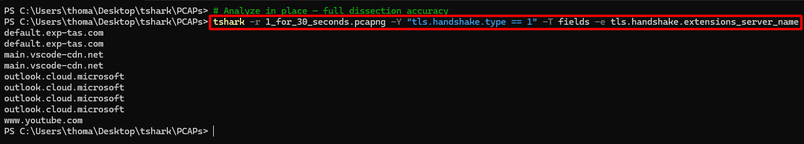

### 6c2: Option B

> **Slice by TCP stream, NOT by packet type (e.g., `Client Hello`)**.

If you want a smaller archived file that still **dissects correctly, include the entire TCP connection that the `Client Hello` belongs to**. This means **filtering by `tcp.stream` rather than `tls.handshake.type == 1`**...

First, based on the original PCAP file, find the *stream numbers* that contain `Client Hello`s, by running:
```
tshark -r full.pcapng -Y "tls.handshake.type == 1" -T fields -e tcp.stream | Sort-Object -Unique
```
Again, based on the same original PCAP file, craft a filter that keeps all packets from those streams (including the `Client Hello` messages) and write them to a new PCAP file. **The resulting file will dissect correctly because each TLS connection is preserved end-to-end**.
```
tshark -r full.pcapng -Y "tcp.stream in {6,7,17}" -w filtered_streams.pcapng
```

Finally, notice again the server names:
```
tshark -r filtered_streams.pcapng -Y "tls.handshake.type==1" -T fields -e tls.handshake.extensions_server_name
```

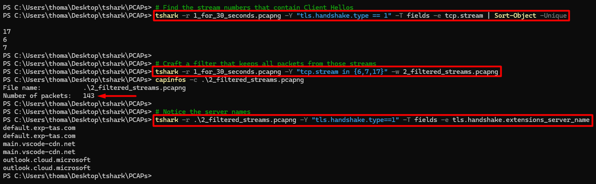

So, the SNI server names are:

```
default.exp-tas.com
default.exp-tas.com
main.vscode-cdn.net
main.vscode-cdn.net
outlook.cloud.microsoft
outlook.cloud.microsof
```

If we open the `filtered_streams.pcapng` file through the GUI, we can see that the `Info` column now renders the message information correctly! No `Ignored Unknown Record` descriptions now.

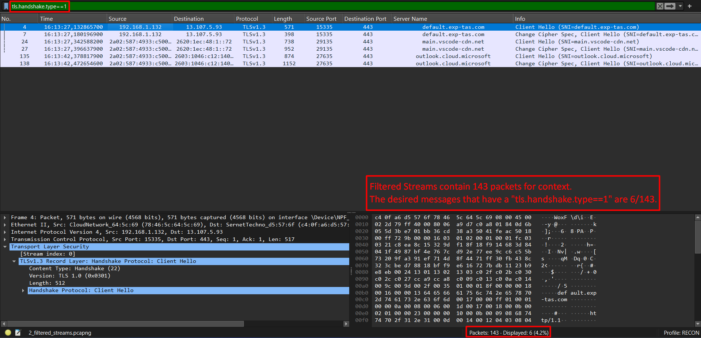

## 6d. Trade-off

*You'll notice that the PCAP file that contains the full TCP streams of `Client Hello` messages is bigger than the PCAP that only contains those messages alone. That's expected and fine, since you're **preserving entire conversations, not just the handshake-initiation packets**.*

**The tradeoff: more bytes, but accurate dissection**. For recon use cases, Option A is still the most efficient. The stream-preserving slice is mainly useful when wanting to share a subset of a capture with someone else who needs it to render correctly in their Wireshark.


# 7. How Protocol Layers Show Up on the Command Line

In the GUI you click `>` to expand each layer. On the CLI, you choose how verbose the output is:

| Flag | What you get |
|---|---|
| (default) | One-line summary per packet |
| `-V` | Full multi-line layer-by-layer dissection (like clicking every `>` in the GUI) |
| `-x` | Hex + ASCII dump of the raw bytes |
| `-P` | Always print the one-line summary, even with `-V` or `-w` |
| `-O <protocol>` | Show full dissection but only for the named protocol(s), e.g. `-O http,dns` |

## 7a. Protocol dissection for the first packet

For a full multi-line layer-by-layer dissection of packet with `id=1`, use the `-V` flag alongside `-c 1` like this:

```powershell
tshark -r first_capture.pcapng -c 1 -V
```

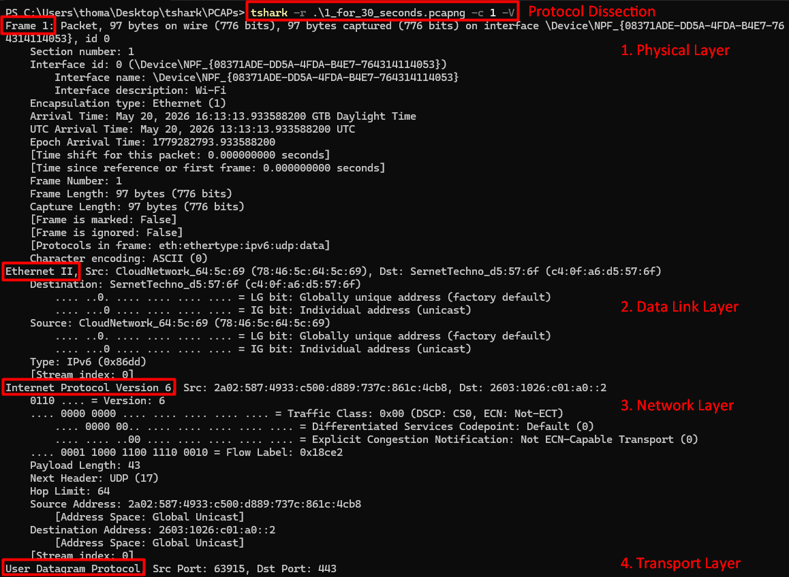

This is the full tree for the very first packet: Frame, Ethernet, IP, TCP/UDP, application, exactly mirroring the GUI's middle pane.

If you want to get the **Hex + ASCII dump** of the raw bytes of the first packet:
```
tshark -r first_capture.pcapng -c 1 -x
```

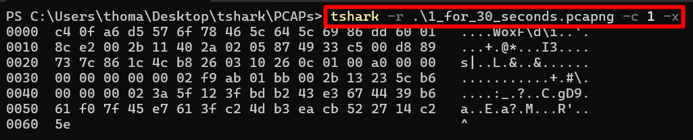

## 7b. Protocol dissection for the first DNS packet

Now, if you want protocol dissection for the first DNS packet, first you need to **filter with `dns` and write a new PCAP file**. Secondly, you can add the flags `-c 1 -V`. Avoid using the `-c 1` flag in the first command! It refers to the very first captured packet, which is NOT a DNS one. That is why you first need to write a DNS-only file and then take the first packet:

```powershell
tshark -r first_capture.pcapng -Y "dns" -w filtered_dns.pcapng
tshark -r filtered_dns.pcapng -c 1 -V 
```

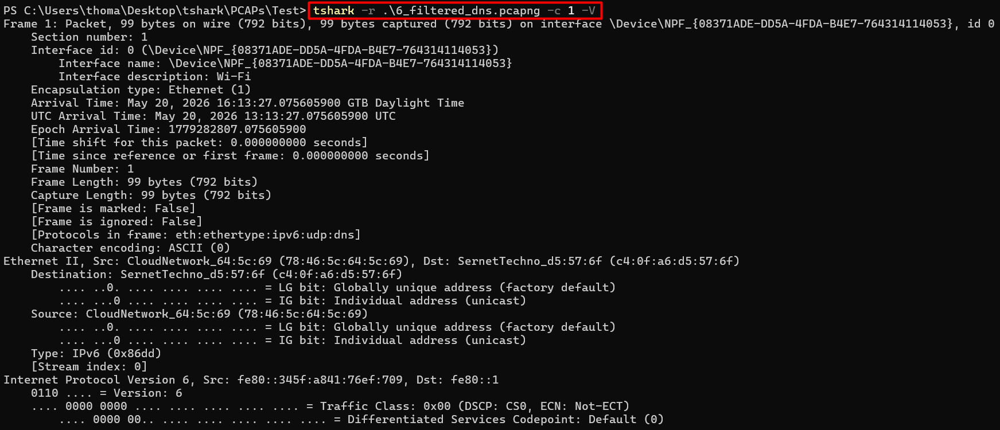

The result is really length. If you want to get **DNS dissection only**, skipping Ethernet/IP/UDP layer details for all frames, run:

```powershell
tshark -r filtered_dns.pcapng -c 1 -O dns
```

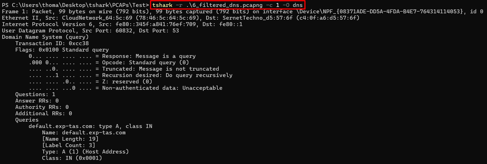


# 8. Capture Filters (`-f`) vs Display Filters (`-Y`)

Exactly the same distinction as in the GUI, just with different flag names:

| | Capture Filter (`-f`) | Display Filter (`-Y`) |
|---|---|---|
| **Syntax** | BPF (Berkeley Packet Filter) | Wireshark display filter language |
| **When applied** | At capture time, by Npcap | After capture, by tshark |
| **Example** | `-f "host 192.168.1.1 and tcp port 80"` | `-Y "ip.addr == 192.168.1.1 and tcp.port == 80"` |
| **Use when** | Capturing on a busy network and want to discard noise early | Always preferred for analysis — full filter power |

**Recommendation:** capture broadly without the capture filter flag `-f`, then iterate with `-Y` against the saved file. You only need `-f` when traffic volume is too high to keep everything.

> If the `-Y` value has a syntax error, tshark fails loudly with a message pointing at the problem — good feedback loop for learning filter syntax.

## 8a. Capture Filter Verification Exercise

```powershell
# Capture ONLY DNS traffic for 30 seconds
tshark -i 1 -a duration:30 -f "udp port 53" -w dns.pcapng
```

Only 4 packets are captured due to the capture filter:

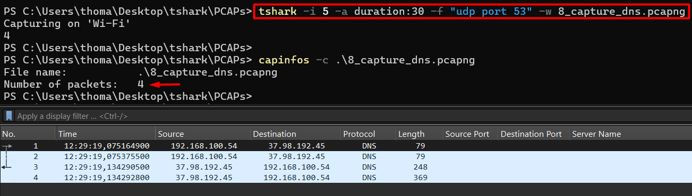

## 8b. Display Filter Verification Exercise

This setting captures everything in the assigned interface. There is a total of 5535 captured packets, from which a small ratio refers to DNS. The next command displays the first 4 DNS packets:

```powershell
# Capture everything for 30 seconds, then display-filter the file to DNS
tshark -i 1 -a duration:30 -w everything.pcapng
tshark -r everything.pcapng -Y "udp.port==53" | Select-Object -First 4
```

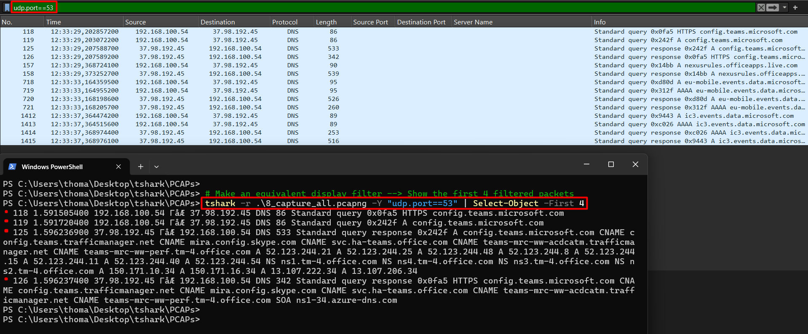


# 9. Display Filter Variables on CLI

**Every display filter from your cheat sheet works identically here.** Just wrap them in `-Y "..."`. Some highlights:

```powershell
# All TLS Client Hellos — every HTTPS destination, with SNI visible
tshark -r everything.pcapng -Y "tls.handshake.type == 1" | Select-Object -First 5

# Web server banners
tshark -r everything.pcapng -Y "http.response and http.server" | Select-Object -First 5

# Connection initiations (recon: who's starting conversations)
tshark -r everything.pcapng -Y "tcp.flags.syn == 1 and tcp.flags.ack == 0" | Select-Object -First 5

# RST-ACKs (recon: closed/refused ports)
tshark -r everything.pcapng -Y "tcp.flags.reset == 1 and tcp.flags.ack == 1" | Select-Object -First 5

# Hostname-leaking traffic
tshark -r everything.pcapng -Y "dhcp.option.hostname or nbns.name or mdns or llmnr" | Select-Object -First 5

# DNS queries for interesting record types
tshark -r everything.pcapng -Y "dns and dns.qry.type in {1,2,15,16,28}" | Select-Object -First 10
```

> 💡 **PowerShell quoting:** if a filter contains double-quotes (e.g. `http.host == "example.com"`), you have two options:
> - Use single quotes outside: `-Y 'http.host == "example.com"'`
> - Or escape: `-Y "http.host == `"example.com`""`
> The single-quote-outside trick is simpler.

* Display the first 5 `Client Hello` messages with `tls.handshake.type==1`:
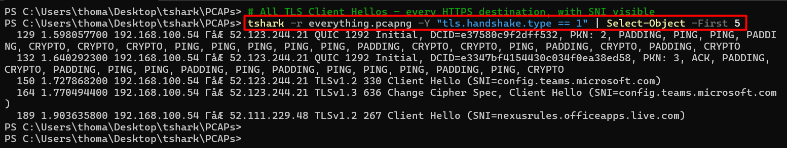

* Display the first 5 connection initiation messages with `tcp.flags.reset==1 and tcp.flags.ack==1`:
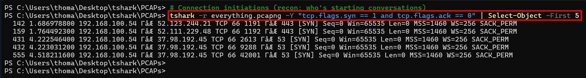

* Display the first 5 interesting DNS queries with `dns.qry.tyipr in {...}`:
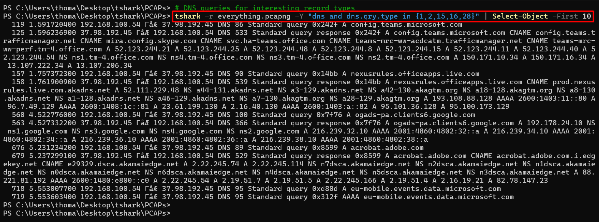


# 10. Extracting Specific Fields (`-T fields`)

**This is the best feature for recon.** Instead of getting the one-line summary, you choose exactly which fields you want, output one row per packet, ready for CSV/Excel/scripting.

## 10a. Syntax

```
-T fields -e <field1> -e <field2> ... [-E header=y] [-E separator=,] [-E quote=d]
```

## 10b. Examples

### 10b1. Build a table of every HTTPS destination (SNI) seen

```powershell
tshark -r everything.pcapng -Y "tls.handshake.type == 1" -T fields -e ip.dst -e tls.handshake.extensions_server_name
```

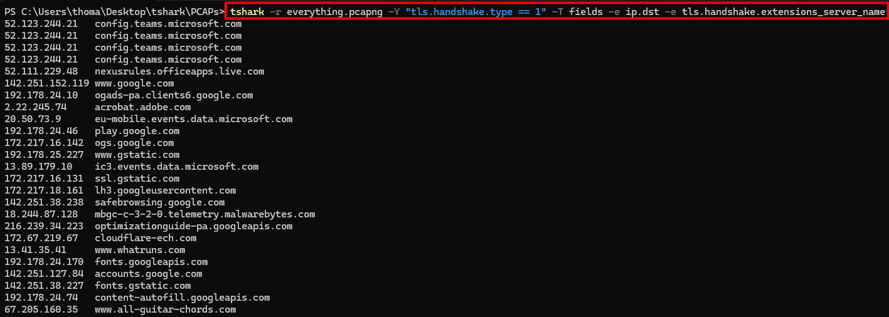

### 10b2. HTTP banner grab

```powershell
tshark -r everything.pcapng -Y "http.response and http.server" -T fields -e ip.src -e tcp.srcport -e http.server
```
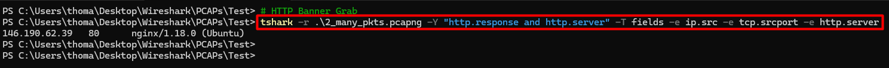

### 10b3. DNS query log

```powershell
tshark -r everything.pcapng -Y "dns.flags.response == 0" -T fields -e ip.src -e dns.qry.name -e dns.qry.type
```
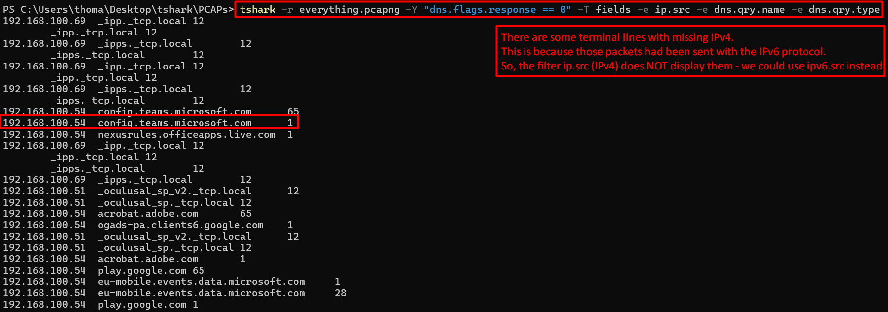

### 10b4. CSV-ready output with headers

```powershell
tshark -r everything.pcapng -Y "http.request" -T fields -e ip.src -e http.host -e http.user_agent -E "header=y" -E "separator=," -E "quote=d"
```

* `-E "header=y"`: `y` stands for "yes", while `n` is the option for saying "no". The flag prints the field names as a **header row** (`ip.src`, `http.host` and `http.user_agent`) **followed by the data rows**. That is why the output is **CSV-ready**.
* `-E "separator=,"`: Use comma between fields instead of the default tab separator.
* `-E "quote=d"`: Wrap each field in double quotes - `d` = double quotes, `s` = single quotes and `n` = none.

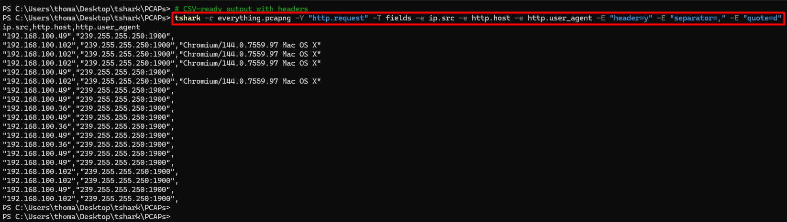

### 10b5. Pipe to a CSV file

```powershell
tshark -r everything.pcapng -Y "http.request" -T fields -e ip.src -e http.host -e http.user_agent -E "header=y" -E "separator=," -E "quote=d" > http_requests.csv
```

Open `http_requests.csv` in Excel or CSViewer for instant inventory:

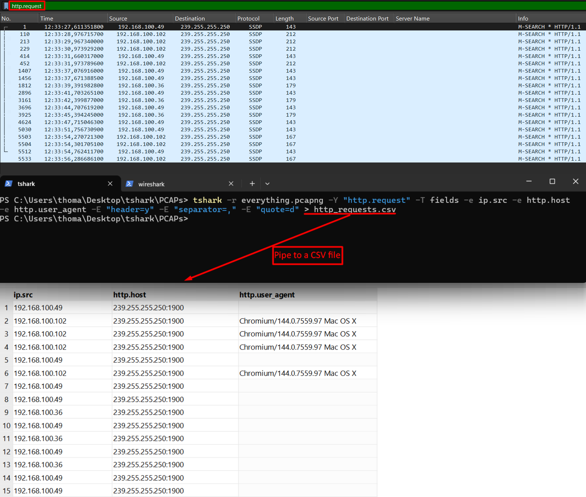

## 10c. Finding field names

Same trick as in the GUI: open a packet in Wireshark, right-click the field you want, **Apply as Filter → Selected** — the filter that pops into the bar contains the exact field name (e.g. `tls.handshake.extensions_server_name`), which you then plug into `-e`.

Also: `tshark -G fields` dumps the entire list of known fields (huge output — grep it for what you want).

## 10d. Verification Exercise

```powershell
tshark -r everything.pcapng -Y "dns" -T fields -e dns.qry.name
```

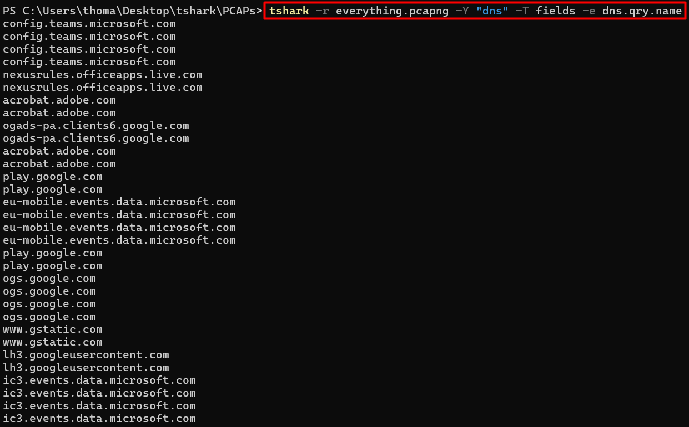

> Many duplicates > Add `dns.qry.type`

```powershell
tshark -r everything.pcapng -Y "dns" -T fields -e dns.qry.name -e dns.qry.type

config.teams.microsoft.com      65
config.teams.microsoft.com      1
config.teams.microsoft.com      1
config.teams.microsoft.com      65
nexusrules.officeapps.live.com  1
nexusrules.officeapps.live.com  1
acrobat.adobe.com       65
acrobat.adobe.com       65
ogads-pa.clients6.google.com    1
ogads-pa.clients6.google.com    1
acrobat.adobe.com       1
acrobat.adobe.com       1
play.google.com 65
play.google.com 65
```

The reason you **see most names twice in a row is that modern systems issue two parallel queries for every hostname: one for an A record (IPv4) and one for an AAAA record (IPv6)**.
When your browser or app wants to connect to `acrobat.adobe.com` for example, the OS resolver **fires off both lookups almost simultaneously so it can pick whichever protocol is available faster**. This is part of "Happy Eyeballs", `RFC 8305`.

That's why you see `play.google.com / play.google.com` - same name, but two different record types being queried in quick succession. You can confirm this by adding the query type as a column:
```
tshark -r everything.pcapng -Y "dns" -T fields -e dns.qry.name -e dns.qry.type
```
You'll see **type 1 (A) and type 28 (AAAA)** alternating for the doubled entries.
The names that appear four times like `config.teams.microsoft.com` usually mean you're also **seeing the responses alongside the queries**. Each query/response pair counts as two packets carrying the same query name. So, we have:
1. query A
2. response A
3. query AAAA
4. response AAAA

You can split these apart with `-Y "dns.flags.response == 0"` for queries only and `-Y "dns.flags.response == 1"` for responses only:
```
tshark -r everything.pcapng -Y "dns and dns.flags.response == 0" -T fields -e dns.qry.name -e dns.qry.type
tshark -r everything.pcapng -Y "dns and dns.flags.response == 1" -T fields -e dns.qry.name -e dns.qry.type
```

And a few names may appear even more because **applications often retry**, or different processes on your machine independently resolved the same name.

Someone could initially think that double names are due to the authoritative and low-level DNS servers being queried during the DNS resolution process. **The recursion through nameservers does happen, but you wouldn't normally see it on your machine. Your computer almost always talks to a recursive resolver (your router, your ISP's DNS, or something like `1.1.1.1` / `8.8.8.8`), and that resolver does all the heavy lifting instead**. It queries the root servers, then the TLD servers (`.com`), then the authoritative server for `acrobat.adobe.com`, and finally hands you back one answer. **From your machine's perspective it's a single query and a single response**. 

To actually see the recursive chain you'd have to capture on the resolver itself, not on your client. **So the duplicates in your output are A/AAAA pairs and query/response pairs, not multi-step recursion**.


# 11. Following Streams and Conversations from the CLI

## 11a. Follow a single TCP stream

The GUI's "Follow → TCP Stream" has a CLI equivalent:

To find TCP stream numbers first:

```powershell
tshark -r everything.pcapng -T fields -e tcp.stream | Sort-Object -Unique
```

This gives you a list of **TCP stream numbers**. Let's follow TCP stream `0`:

```powershell
tshark -r everything.pcapng -q -z follow,tcp,ascii,0
```

For HTTP streams specifically:

```powershell
tshark -r everything.pcapng -q -z follow,http,ascii,0
```

## 11b. Verification Exercise

Pick any TCP stream number from your capture and follow it. You should see the reassembled conversation, with sides distinguished. For unencrypted protocols (HTTP, FTP, plain SMTP) this is fully readable; for TLS you'll just see encrypted bytes.

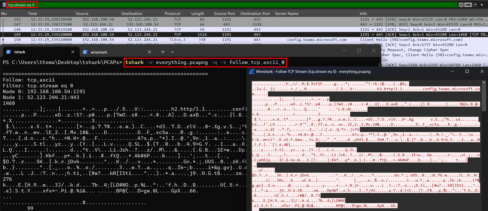


# 12. Statistics from the Command Line (`-z`)

This is where tshark becomes a **recon dashboard generator**. The `-z` flag runs statistics modules; combine with quiet flag `-q` to suppress the per-packet output and only see the summary.

## 12a. Endpoint inventory (who exists)

```powershell
tshark -r everything.pcapng -q -z endpoints,ip
```

Lists every IP that appeared, with packet/byte counts in each direction. This is the CLI equivalent of **Statistics → Endpoints → IPv4** in the GUI.

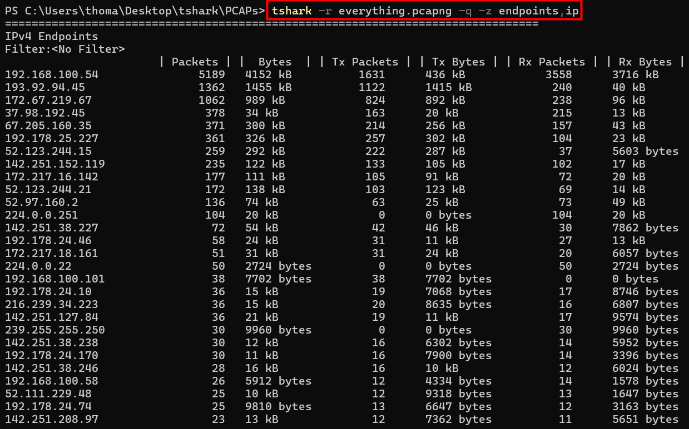

Other endpoint tables:
- `-z endpoints,eth` — MAC addresses
- `-z endpoints,ipv6`
- `-z endpoints,tcp` — IP:port pairs (very useful — shows every "service endpoint" seen)
- `-z endpoints,udp`

## 12b. Conversations (who talks to whom)

```powershell
tshark -r everything.pcapng -q -z conv,ip
tshark -r everything.pcapng -q -z conv,tcp
```

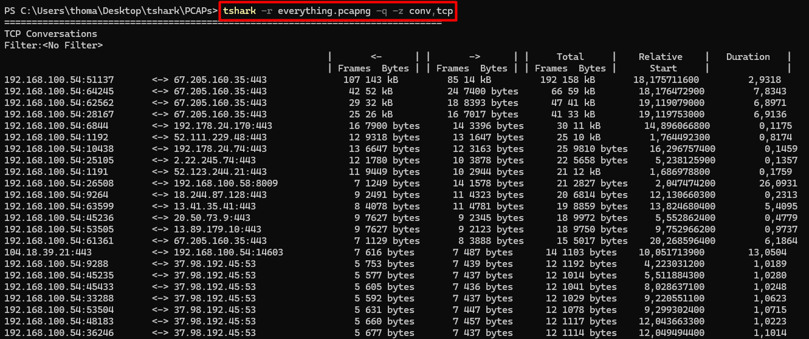

## 12c. Protocol hierarchy (what's on this network)

```powershell
tshark -r everything.pcapng -q -z io,phs
```

**Tree view of byte/packet percentages by protocol**. Identical to `Statistics → Protocol Hierarchy` in the GUI. For recon purposes, this is your "what kind of network am I on" snapshot. It shows what protocols make up your capture and how they nest inside each other. Read it as a tree: **each indentation level is one layer deeper in the protocol stack**. The numbers next to each protocol are the count of frames and bytes that contained that protocol.

Regarding the flags:
* `io`: The I/O statistics family of reports like byte counts, throughput and hierarchy.
* `phs`: Stands for `protocol hierarchy statistics`, which is a specific report inside the `io` family.
* Other useful variants include flags like `io,stat,1` and `io,stat,10,"tcp","udp"`.

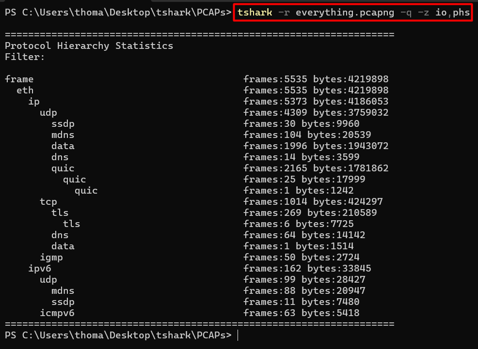

## 12d. Per-protocol stats

### 12d1. HTTP request/response breakdown
```powershell
# HTTP request/response breakdown
tshark -r everything.pcapng -q -z http,tree
```
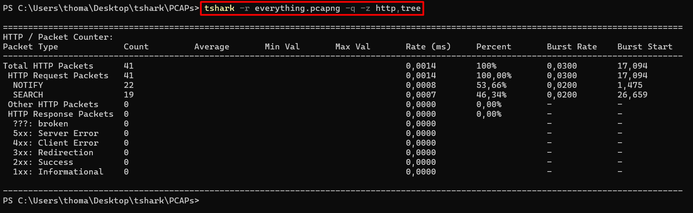

### 12d2. HTTP request methods + URLs
```powershell
# HTTP request methods + URLs
tshark -r everything.pcapng -q -z http_req,tree
```
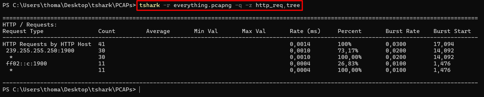

### 12d3. DNS query breakdown
```powershell
# DNS query breakdown
tshark -r everything.pcapng -q -z dns,tree
```
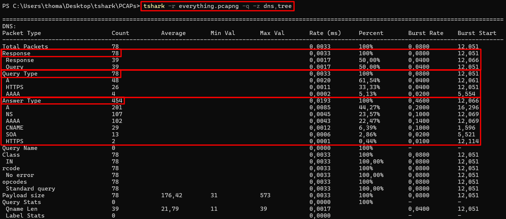

### 12d4. SMB service response times
```powershell
# SMB service response times
tshark -r everything.pcapng -q -z smb,srt
```

### 12d5. Resolved hostnames table
```powershell
# Resolved hostnames table
tshark -r everything.pcapng -q -z hosts
```
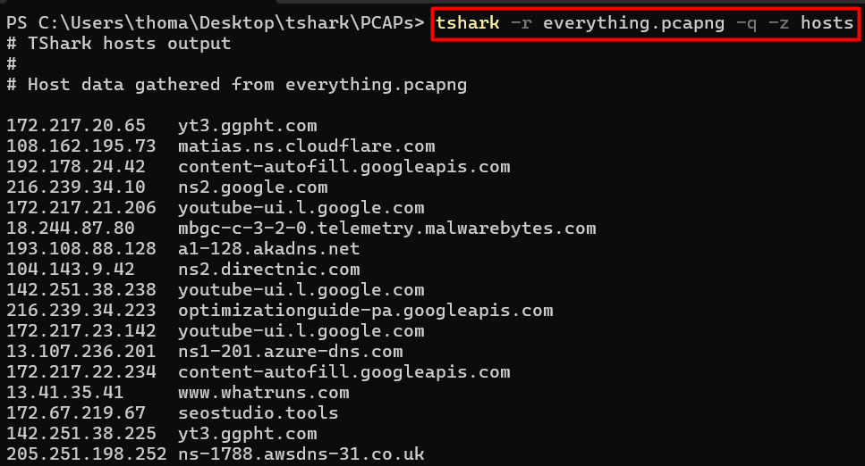

## 12e. Full recon snapshot of a capture

One command, five stats blocks. Useful as a "what did I just capture?" first look.

```powershell
tshark -r everything.pcapng -q -z io,phs -z endpoints,ip -z conv,ip -z http,tree -z dns,tree
```
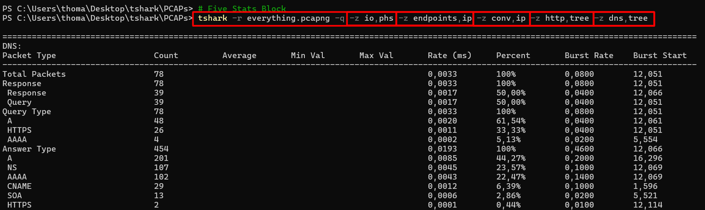


# 13. Output Formats and Piping

The default text output is convenient but not machine-friendly. Other formats:

| Flag | Output format |
|---|---|
| `-T text` | Default one-line summary with columns `no`, `time`, `source`, `destination`, `protocol`, `length` and `Info` |
| `-T fields -e ...` | **Custom field extraction**:  always include `-e` |
| `-T json` | Full JSON tree per packet: every field, every layer |
| `-T ek` | Elasticsearch bulk-import JSON (one packet per line) |
| `-T pdml` | XML dissection (verbose) |
| `-T tabs` | Tab-separated text |

## 13a. Examples

### 13a1. JSON output
```powershell
# JSON of DNS packets only — pipe to a JSON viewer or jq
tshark -r everything.pcapng -Y "dns" -T json > dns.json
```
> This command might take too much hour or even generate a JSON output that is NOT a valid JSON...

### 13a2. CSV output
```powershell
# CSV with the fields you want
tshark -r everything.pcapng -Y "http.request" -T fields -e ip.src -e http.host -E separator="," > hosts.csv
tshark -r everything.pcapng -Y "dns" -T fields -e dns.qry.name -e dns.qry.type -E separator="," > dns.csv
```

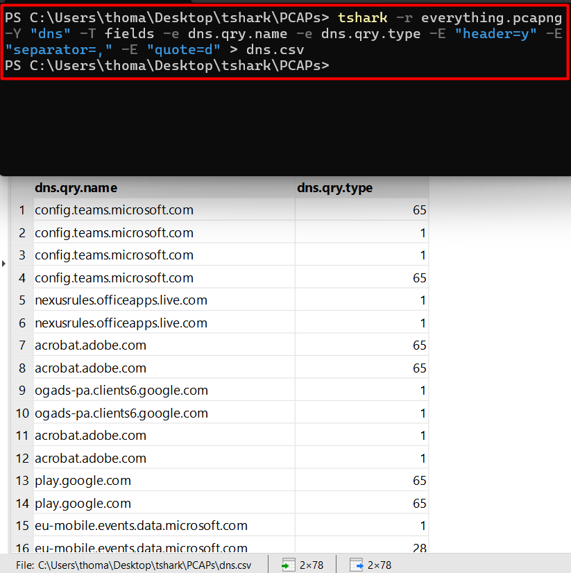

### 13a3. Powershell output

To answer to the recon question `"What unique HTTPS destinations did I see?"`, run:
```powershell
# PowerShell Text Processing
tshark -r everything.pcapng -Y "tls.handshake.type == 1" -T fields -e tls.handshake.extensions_server_name | Sort-Object -Unique
```

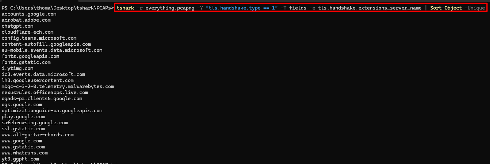

To count the unique DNS names queried in the capture:

```powershell
tshark -r everything.pcapng -Y "dns.qry.name" -T fields -e dns.qry.name | Sort-Object -Unique | Measure-Object
```

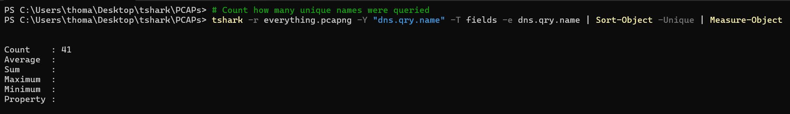


# 14. Long-Running Captures, Rotation, and Ring Buffers

Sometimes, we want to leave a capture running for a long time. Don't write to a single huge file. **Use rotation**.

## 14a. Time-based rotation

```powershell
tshark -i 1 -b duration:300 -b files:12 -w rotating.pcapng
```

Rotates every 300 seconds (5 min), keeps the most recent 12 files (= 1 hour history). Files are named `rotating_00001_<timestamp>.pcapng`, etc. The next screenshot proves that this setting indeed keeps only 4 files, the most recent ones!

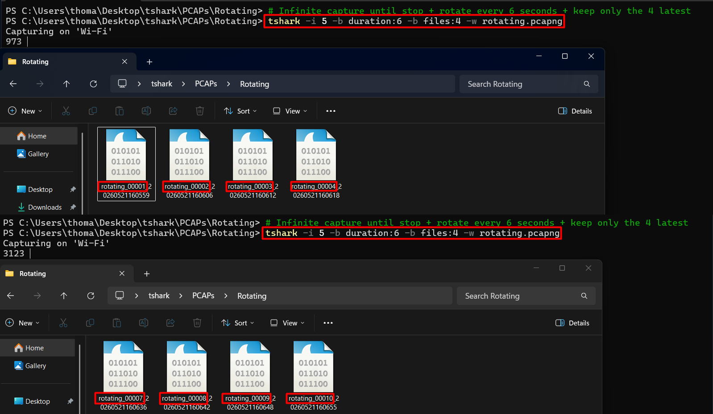

## 14b. Size-based rotation

```powershell
tshark -i 1 -b filesize:100000 -b files:10 -w rotating.pcapng
```

Rotates every 100 MB (`filesize` is in KB), keeps the most recent 10 files.

## 14c. Autostop entirely after some duration

```powershell
tshark -i 1 -a duration:3600 -b filesize:50000 -w session.pcapng
```

Captures for 1 hour total, rotating at 50 MB chunks. Stops automatically — useful for unattended captures.

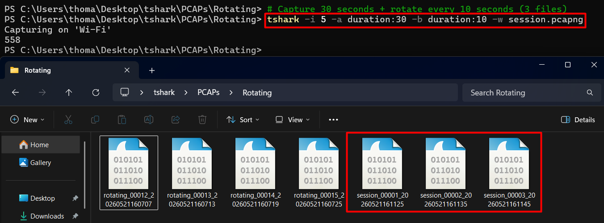

## 14d. Verification Exercise

Start a short rotating capture (1-minute slices, 3 files max):

```powershell
tshark -i 1 -b duration:60 -b files:3 -a duration:200 -w rot_test.pcapng
```

After ~3 minutes, look at the current directory. You'll see 3 files named `rot_test_*.pcapng`. List them:

```powershell
Get-ChildItem rot_test_*.pcapng
```


# 15. Common Gotchas on Windows 11 / PowerShell

- **"tshark is not recognized"** in a new PowerShell window even after PATH fix → the env var was set for `"Process"` scope instead of `"User"`. Re-run with `"User"` scope and reopen the terminal.
- **Quoting filters with `"`** → use single quotes outside if your filter contains double quotes: `-Y 'http.host == "example.com"'`. Easier than backtick-escaping.
- **Output looks garbled or stalled** → tshark buffers output by default. For real-time streaming, add `-l` (line-buffered): `tshark -i 1 -l`.
- **`-c` and `-a duration:N` don't combine intuitively** → whichever condition triggers first stops the capture. `-c 100 -a duration:60` means "stop at 100 packets OR 60 seconds, whichever comes first."
- **Live capture errors with permission denied** → run PowerShell as Administrator, or reconfigure Npcap to allow non-admin capture.
- **Field name not recognized in `-e`** → typo, or wrong protocol version. Use `tshark -G fields | findstr "<part-of-name>"` to confirm the exact spelling. Or right-click in the GUI as described in [section 10](#10-extracting-specific-fields--t-fields).
- **JSON output is huge** → `-T json` includes every dissected field per packet; for big captures, prefer `-T fields` with explicit `-e` choices.
- **`Sort-Object -Unique` is slow on huge outputs** → for very large captures, pipe to `findstr` first to narrow, then sort.


---
---


# Recon-Oriented Exercises

These mirror the GUI exercises but produce **structured output you could paste into a report**.

## Exercise 1: Quiet-machine fingerprint (CLI version)

Fields to view after applying display filters:
* `http.server`
* `http.response.version`
* `http.response.code`
* `http.request.uri`

Capture 60 seconds with no Internet activity! You can start Docker engine and run locally some Docker containers, preferrably with a web server component. After that:

```powershell
tshark -i 1 -a duration:60 -w quiet.pcapng
tshark -r quiet.pcapng -q -z io,phs
tshark -r quiet.pcapng -q -z conv,ip
tshark -r quiet.pcapng -q -z endpoints,ip
tshark -r quiet.pcapng -Y "http.server"
```

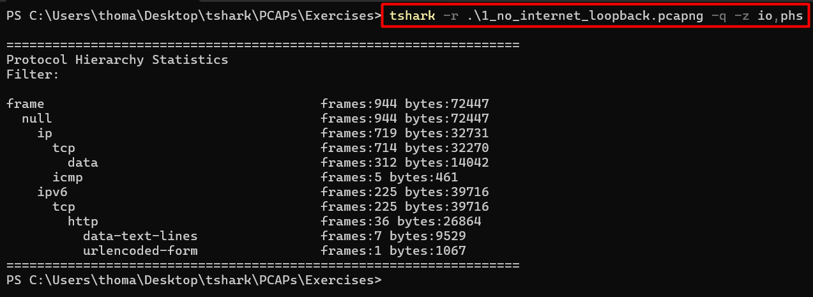

Run the next command to see HTTP response information:
```powershell
tshark -r quiet.pcapng -Y "http.server" -T fields -e http.server -e http.response.version -e http.response.code

Apache/2.4.25 (Debian)  HTTP/1.1        200
Apache/2.4.25 (Debian)  HTTP/1.1        302
Apache/2.4.25 (Debian)  HTTP/1.1        200
Apache/2.4.25 (Debian)  HTTP/1.1        302
Apache/2.4.25 (Debian)  HTTP/1.1        200
nginx   HTTP/1.1        400
nginx   HTTP/1.1        400
Apache/2.4.25 (Debian)  HTTP/1.1        302
Apache/2.4.25 (Debian)  HTTP/1.1        200
Apache/2.4.25 (Debian)  HTTP/1.1        200
```

Also, run while having added `http.request.uri`:
```powershell
tshark -r quiet.pcapng -Y "http.server" -T fields -e http.server -e http.response.version -e http.response.code -e http.request.uri
```

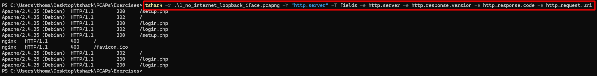

The filter `http.server` **mathces HTTP response packets**, since only these packets contain the `http.server` field. By also navigating to the GUI and applying the same filter, we can notice that there are HTTP responses that contain a field named `http.request.uri`, despite the fact that the filtered packets are NOT HTTP requests. **When we ask for `http.request.uri` on an HTTP response packet, the dissector resolves the link and pulls the URI from the corresponding HTTP request packet, then displays it as if it were on the HTTP response.** We can verify this behavior by running the previous command, adding `-e http.request.uri`:
```powershell
tshark -r quiet.pcapng -Y "http.server" -T fields -e http.server -e http.response.version -e http.response.code -e http.request.uri

Apache/2.4.25 (Debian)  HTTP/1.1        200     /setup.php
Apache/2.4.25 (Debian)  HTTP/1.1        302     /
Apache/2.4.25 (Debian)  HTTP/1.1        200     /login.php
Apache/2.4.25 (Debian)  HTTP/1.1        302     /login.php
Apache/2.4.25 (Debian)  HTTP/1.1        200     /setup.php
nginx   HTTP/1.1        400     /
nginx   HTTP/1.1        400     /favicon.ico
Apache/2.4.25 (Debian)  HTTP/1.1        302     /
Apache/2.4.25 (Debian)  HTTP/1.1        200     /login.php
Apache/2.4.25 (Debian)  HTTP/1.1        200     /login.ph
```

Thus, we saw that the field `http.request.uri` can be extracted from HTTP response packets (10 here). However, this field *mainly lives* under HTTP request packets (26 here), so if we filter by this, we will get:

```powershell
tshark -r quiet.pcapng -Y "http.request.uri" -T fields -e http.request.uri

/
/
/static/js/main.c9e951e4.js
/static/css/main.27312bf9.css
/static/js/main.c9e951e4.js
/static/css/main.27312bf9.css
/favicon.ico
/favicon.ico
/setup.php
/setup.php
/
/
/login.php
/login.php
/login.php
/login.php
/setup.php
/setup.php
/
/
/favicon.ico
/favicon.ico
/
/
/static/js/main.c9e951e4.js
/static/css/main.27312bf9.css
/static/js/main.c9e951e4.js
/static/css/main.27312bf9.css
/favicon.ico
/favicon.ico
/
/
/login.php
/login.php
/login.php
/login.ph
```

Finally:
```powershell
tshark -r cap.pcapng -Y "http.request" -T fields -e ip.src -e http.host -e http.request.method -e http.request.uri -e http.user_agent -E header="y" -E separator="," -E quote="d" > http_requests.csv


ip.src,http.host,http.request.method,http.request.uri,http.user_agent

,"localhost:8087","GET","/","Mozilla/5.0 (Windows NT 10.0; Win64; x64) AppleWebKit/537.36 (KHTML, like Gecko) Chrome/148.0.0.0 Safari/537.36"

,"localhost:8087","GET","/static/js/main.c9e951e4.js","Mozilla/5.0 (Windows NT 10.0; Win64; x64) AppleWebKit/537.36 (KHTML, like Gecko) Chrome/148.0.0.0 Safari/537.36"

,"localhost:8087","GET","/static/css/main.27312bf9.css","Mozilla/5.0 (Windows NT 10.0; Win64; x64) AppleWebKit/537.36 (KHTML, like Gecko) Chrome/148.0.0.0 Safari/537.36"

,"localhost:8087","GET","/favicon.ico","Mozilla/5.0 (Windows NT 10.0; Win64; x64) AppleWebKit/537.36 (KHTML, like Gecko) Chrome/148.0.0.0 Safari/537.36"

,"localhost:8089","GET","/setup.php","Mozilla/5.0 (Windows NT 10.0; Win64; x64) AppleWebKit/537.36 (KHTML, like Gecko) Chrome/148.0.0.0 Safari/537.36"

,"localhost:8089","GET","/","Mozilla/5.0 (Windows NT 10.0; Win64; x64) AppleWebKit/537.36 (KHTML, like Gecko) Chrome/148.0.0.0 Safari/537.36"
```

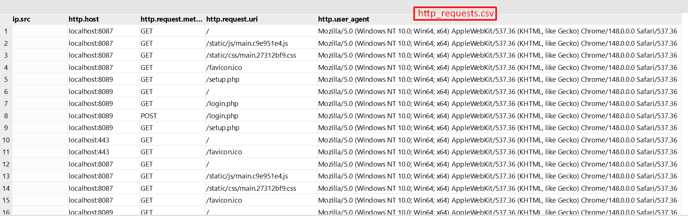


## Exercise 2: Local hostname inventory

Fields to view after applying display filters:
* `ip.src`
* `dns.ptr.domain_name`
* `dns.resp.name`

```powershell
tshark -i 1 -a duration:180 -f "(arp or port 5353 or port 137 or port 138 or port 5355 or port 1900) or (udp port 67 or udp port 68)" -w local_disco.pcapng


# Extract local IPs from mDNS
tshark -r local_disco.pcapng -Y "mdns and dns.flags.response == 1" -T fields -e ip.src | Sort-Object -Unique

# Extract local hostnames from mDNS
tshark -r local_disco.pcapng -Y "mdns and dns.flags.response == 1" -T fields -e ip.src -e dns.ptr.domain_name | Sort-Object -Unique

# Extract response names from mDNS
tshark -r .local_disco.pcapng -Y "mdns and dns.flags.response == 1" -T fields -e ip.src -e dns.resp.name | Sort-Object -Unique
```

```powershell
# Write local hostnames to CSV
tshark -r local_disco.pcapng -Y "mdns and dns.flags.response == 1" -T fields -e ip.src -e dns.ptr.domain_name -E header="y" -E separator="," | Sort-Object -Unique > local_hostnames.csv
```

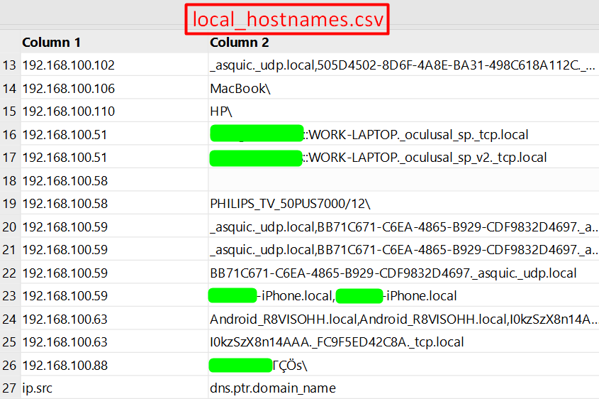

Some extra command that may produce no output based on the filter which is difficult to be satisfied:
```powershell
# Extract names from NetBIOS
tshark -r local_disco.pcapng -Y "nbns" -T fields -e ip.src -e nbns.name | Sort-Object -Unique

# Extract hostnames from DHCP
tshark -r local_disco.pcapng -Y "dhcp.option.hostname" -T fields -e dhcp.hw.mac_addr -e dhcp.option.hostname -E header="y"
```

✅ **Verification:** you should produce three tables — DHCP hostnames, mDNS names, NetBIOS names — that together inventory the named devices on your LAN.

## Exercise 3: Full HTTPS destination report (passive, encrypted-aware)

```powershell
tshark -i 1 -a duration:120 -w everything.pcapng

tshark -r everything.pcapng -Y "tls.handshake.type == 1" -T fields -e ip.src -e ip.dst -e tls.handshake.extensions_server_name -E header="y" -E separator="," > https_dests.csv
```

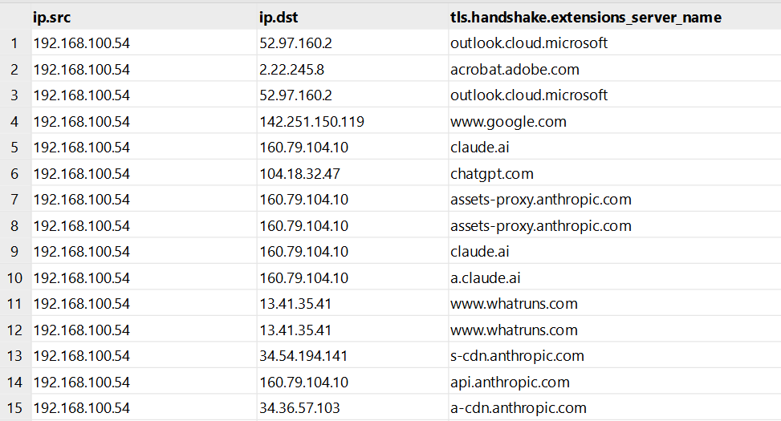

## Exercise 4: Banner-grab summary across protocols

You can find a pcap file designed for malware analysis, since it may contain a **variety of protocols such as HTTP, SMB, FTP and SS**H:

Run:
```powershell
tshark -r traffic_malware.pcap -Y "http or smb or ssh or ftp" -T fields -e ip.src -e tcp.srcport -e http.server -e smb.native_os -e ssh.protocol -e ftp.response.arg -E header="y" -E separator="," | Sort-Object -Unique
```

Or for fewer results: 

```powershell
tshark -r traffic_malware.pcap -Y "http.server or smb.native_os or ssh.protocol or ftp.response.code == 220" -T fields -e ip.src -e tcp.srcport -e http.server -e smb.native_os -e ssh.protocol -e ftp.response.arg -E header="y" -E separator="," | Sort-Object -Unique
```

Or to extract the results:

```powershell
tshark -r traffic_malware.pcap -Y "http.server or smb.native_os or ssh.protocol or ftp.response.code == 220" -T fields -e ip.src -e tcp.srcport -e http.server -e smb.native_os -e ssh.protocol -e ftp.response.arg -E header="y" -E separator="," | Sort-Object -Unique > banner_grabbing.csv
```

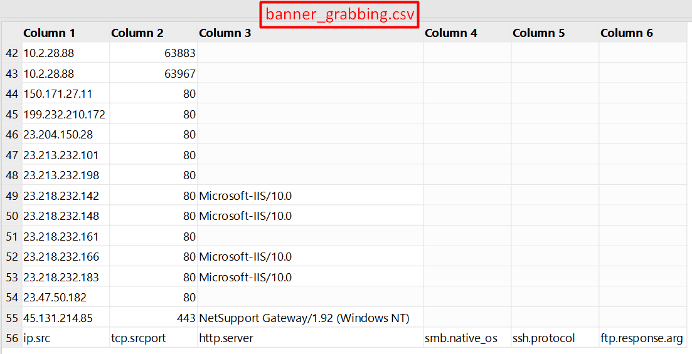


## Exercise 5: Passive OS hints from TTL

```powershell
tshark -r everything.pcapng -Y "ip.ttl" -T fields -e ip.src -e ip.ttl | Sort-Object -Unique
```

```powershell
tshark -r everything.pcapng -Y "ip.ttl" -T fields -e ip.src -e ip.ttl | Sort-Object -Unique > passive_os_ttl.csv
```

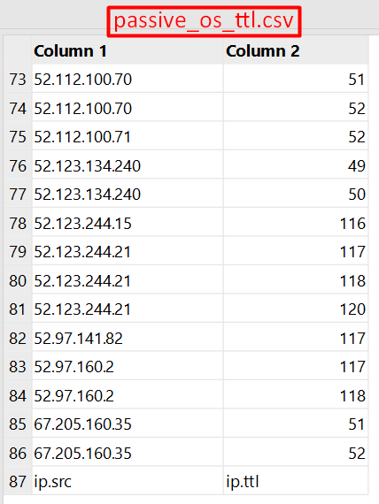


# Cheat Sheet

## A. Most-used flags

| Flag | Purpose |
|---|---|
| `-D` | List interfaces |
| `-i <iface>` | Interface (number or name) for live traffic capture |
| `-r <file>` | Read from pcap file |
| `-w <file>` | Write to pcap file |
| `-c <N>` | Stop after N packets: better combined with `-i` live capture flag, since with `-r`, the flag `-c` refers to a limit when reading, not after filtering |
| `-a duration:<sec>` | Autostop after seconds |
| `-a filesize:<KB>` | Autostop after KB written |
| `-b duration:<sec>` | Ring buffer rotation interval |
| `-b filesize:<KB>` | Ring buffer file size |
| `-b files:<N>` | Ring buffer file count |
| `-f "<BPF>"` | Capture filter (BPF syntax) |
| `-Y "<display>"` | Display filter (Wireshark syntax) |
| `-T fields -e <field>` | Extract specific fields |
| `-T json` / `-T ek` / `-T pdml` | Alternate output formats |
| `-E header="y" -E separator=","` | CSV formatting for `-T fields` |
| `-V` | Verbose per-packet dissection |
| `-x` | Hex+ASCII dump |
| `-O <proto>` | Verbose only for named protocols |
| `-q` | Quiet — suppress per-packet output (use with `-z`) |
| `-z <stat>` | Run a statistics module |
| `-n` | No name resolution |
| `-N <flags>` | Selective name resolution (m/n/t/C) |
| `-t <fmt>` | Time format (a/ad/d/r/...) |
| `-l` | Line-buffered output (for live streaming) |

## B. Top 10 recon one-liners

```powershell
# 1. List interfaces
tshark -D

# 2. Quick live capture, file output
tshark -i 1 -a duration:60 -w cap.pcapng

# 3. Open and summarize what's in a pcap
tshark -r cap.pcapng -q -z io,phs

# 4. Endpoint inventory
tshark -r cap.pcapng -q -z endpoints,ip

# 5. Unique HTTPS destinations (SNI)
tshark -r cap.pcapng -Y "tls.handshake.type == 1" -T fields -e tls.handshake.extensions_server_name | Sort-Object -Unique

# 6. Unique DNS queries
tshark -r cap.pcapng -Y "dns.flags.response == 0" -T fields -e dns.qry.name | Sort-Object -Unique

# 7. HTTP server banners
tshark -r cap.pcapng -Y "http.response and http.server" -T fields -e ip.src -e http.server | Sort-Object -Unique

# 8. Local hosts via DHCP hostnames
tshark -r cap.pcapng -Y "dhcp.option.hostname" -T fields -e dhcp.hw.mac_addr -e dhcp.option.hostname

tshark -r local_disco.pcapng -Y "mdns and dns.flags.response == 1" -T fields -e ip.src -e dns.ptr.domain_name | Sort-Object -Unique


# 9. TCP SYNs (connection attempts / scan signal)
tshark -r cap.pcapng -Y "tcp.flags.syn == 1 and tcp.flags.ack == 0" -T fields -e ip.src -e ip.dst -e tcp.dstport

# 10. CSV export of HTTP requests
tshark -r cap.pcapng -Y "http.request" -T fields -e ip.src -e http.host -e http.request.method -e http.request.uri -e http.user_agent -E header="y" -E separator="," -E quote="d" > http_requests.csv
```

## C. Mapping between GUI and CLI

| Action | Wireshark GUI | tshark CLI |
|---|---|---|
| Pick interface | Welcome screen → double-click | `-i <N>` |
| Start capture | Shark-fin button | (the capture starts when you run the command) |
| Stop capture | Red-square button | `-c N`, `-a duration:N`, or Ctrl+C |
| Save | File → Save As | `-w file.pcapng` |
| Open | File → Open | `-r file.pcapng` |
| Display filter | Filter bar | `-Y "..."` |
| Capture filter | Capture → Options | `-f "..."` |
| Statistics → Endpoints | Menu | `-q -z endpoints,ip` |
| Statistics → Conversations | Menu | `-q -z conv,ip` |
| Statistics → Protocol Hierarchy | Menu | `-q -z io,phs` |
| Follow → TCP Stream | Right-click | `-q -z follow,tcp,ascii,<N>` |
| Add column | Right-click field → Apply as Column | `-T fields -e <field>` |
| Verbose detail of packet | Click `>` to expand | `-V` |


