# Table of Contents

> A hands-on guide for learning Wireshark as part of passive reconnaissance work.
> Each section includes things to try and how to verify them. Add screenshots under the relevant headings as you complete the exercises.

1. [Installation and First Launch](#1-installation-and-first-launch)
2. [What Wireshark Actually Does](#2-what-wireshark-actually-does)
3. [The GUI: Anatomy of the Main Window](#3-the-gui-anatomy-of-the-main-window)
4. [Your First Capture](#4-your-first-capture)
5. [Understanding the Packet List Columns](#5-understanding-the-packet-list-columns)
6. [The Three Panes Explained](#6-the-three-panes-explained)
7. [How Packets Split Into Protocols (Encapsulation)](#7-how-packets-split-into-protocols-encapsulation)
8. [Capture Filters vs Display Filters](#8-capture-filters-vs-display-filters)
9. [Display Filter Syntax and Common Variables](#9-display-filter-syntax-and-common-variables)
10. [Following Streams and Conversations](#10-following-streams-and-conversations)
11. [Statistics: The Recon Goldmine](#11-statistics-the-recon-goldmine)
12. [Coloring Rules and Profiles](#12-coloring-rules-and-profiles)
13. [Saving, Exporting, and Re-opening Captures](#13-saving-exporting-and-re-opening-captures)
14. [Practical Exercises (Recon-Oriented)](#14-practical-exercises-recon-oriented)
15. [Common Gotchas on Windows 11](#15-common-gotchas-on-windows-11)
16. [Cheat Sheet](#16-cheat-sheet)


# 1. Installation and First Launch

## 1a. Install steps

1. Download the Windows installer from <https://www.wireshark.org/download.html>.
2. Run the installer. **Critical step:** when it asks whether to install **Npcap**, say yes. **Npcap is the packet-capture driver, so without it, Wireshark can open existing `.pcap` files but cannot capture live traffic!**
3. In the Npcap sub-installer, accept the defaults. The `Support raw 802.11 traffic` and `Install Npcap in WinPcap API-compatible Mode` options are fine on.
4. Finish installation and launch **Wireshark** from the Start menu.

## 1b. Verify the install

- Open Wireshark. On the **Welcome screen** you should see a list of network interfaces (Wi-Fi, Ethernet, Loopback, etc.) each with a small live sparkline showing current traffic.
- If the interface list is empty or greyed out: reboot once (Npcap requires it), then relaunch. If still empty, re-run the Wireshark installer and re-tick Npcap.

> Welcome Screen

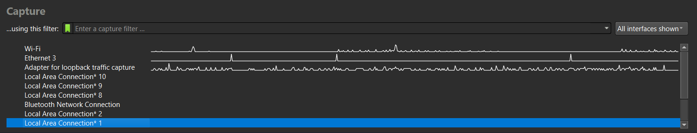


# 2. What Wireshark Actually Does

Wireshark is a **packet analyzer**. It does three things, in order:

1. **Captures** — tells the Npcap driver to copy every frame seen by a network interface into Wireshark's memory.
2. **Analyzes** — parses each captured frame layer-by-layer (Ethernet → IP → TCP → HTTP, for example) using **hundreds of built-in protocol decoders**.
3. **Presents** — displays everything in a filterable, **searchable GUI** with reassembled streams, statistics, and export options.

**For a reconnaissance task, this matters because:**
- You can see what devices exist on your local network without sending probes (**passive**).
- You can **read service banners, OS hints, hostnames, and software versions** out of normal traffic.
- You **produce `.pcap` files** that are analyzable offline, by other tools (tshark, NetworkMiner, p0f).

*Note: Wireshark is **NOT** an active scanner, since it does not send packets at targets. It just monitors and captures the traffic passing through an interface. Also, it cannot read encrypted payloads (TLS, SSH) without the encryption keys.*


# 3. The GUI: Anatomy of the Main Window

After you start a capture (next section), the main window has these regions, top to bottom:

| Region | What it is |
|---|---|
| **Menu Bar** | File - Edit - View - Go - Capture - Analyze - Statistics - Telephony - Wireless - Tools - Help |
| **Main Toolbar** | Start capturing packets - Stop capturing packets - Restart capturing packets - Capture options - Open file - Save capture as - Close this capture file - Reload this file - Find packet (display filter) - Go to previous packet - Go to next packet - Go to specified packet - Go to first packet - Go to last packet - Automatically scroll to last packet during live capture - Draw packets using your coloring rules - Zoom in - Zoom out - Back to normal zoom - Resize packet list columns to fit contents - Reset layout to default size |
| **Filter Toolbar** | The big text box where you type **display filters** (e.g. `ip.addr == 192.168.1.1`) |
| **Packet List Pane** | One row per captured packet, with summary columns |
| **Packet Details Pane** | Tree view of the selected packet, expandable by protocol layer |
| **Packet Bytes Pane** | Raw hex + ASCII of the selected packet |
| **Status Bar** | Capture File Info - Packets Count - Current Profile (e.g., `default`) |

You can resize the three panes by dragging their borders. **View → Layout** also lets you rearrange them.

## Verification Exercise

> Notice the 3 distinct panes

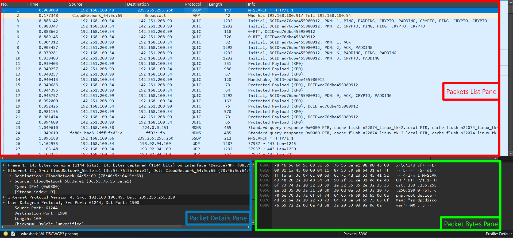


# 4. The First Capture

## 4a. Steps

1. On the Welcome screen, double-click your **Wi-Fi** or **Ethernet** interface (whichever you're using).
2. Capture starts immediately — packets begin scrolling in the packet list.
3. In a browser, visit a plain HTTP site (HTTPS is fine too, you just won't see content). A good test target: <http://httpforever.com/> — it's intentionally HTTP-only and harmless.
4. After ~10 seconds, click the **red square** in the toolbar to stop the capture.
5. You should have at least a few hundred packets.

## 4b. Verification Exercise

> In the filter bar, type `http` and press Enter. You should see `GET` requests and `200 OK` responses if you visited the HTTP site. Also, click one of the `GET` request packets — the details pane shows the layered breakdown.

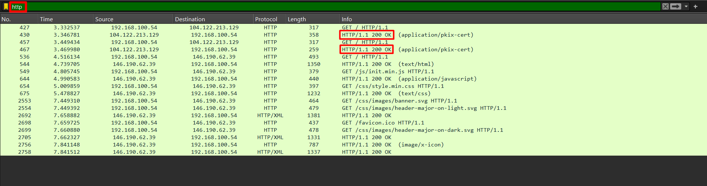
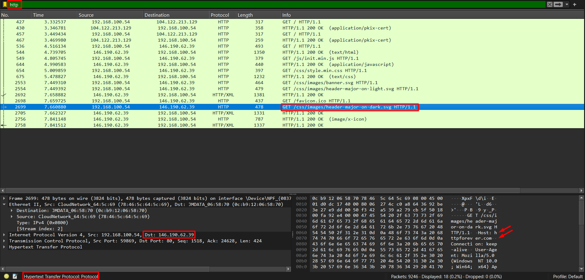

> As a second verification step, since we visited `http://httpforever.com/`, we can find its IP and then search if there are indeed packets that have this IP as a source or destination IP.

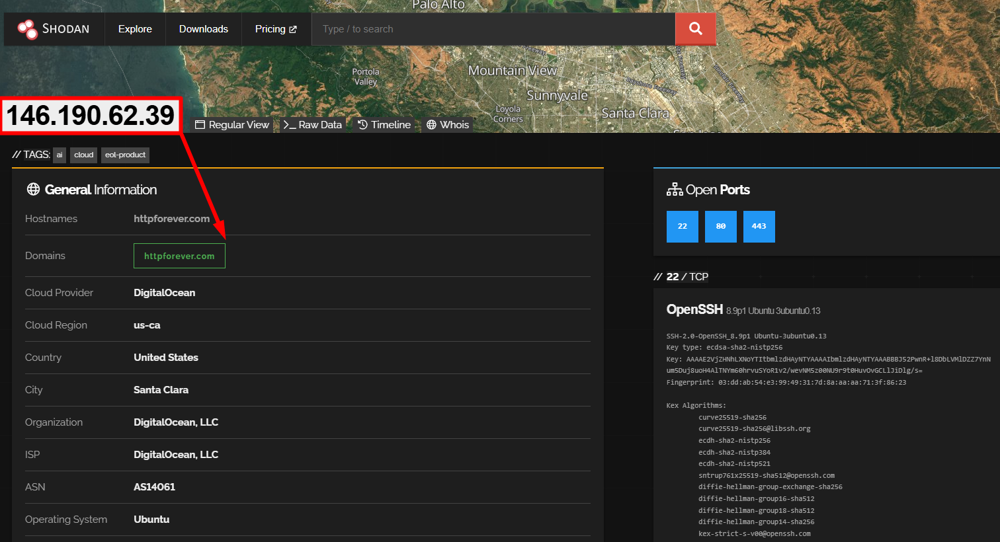
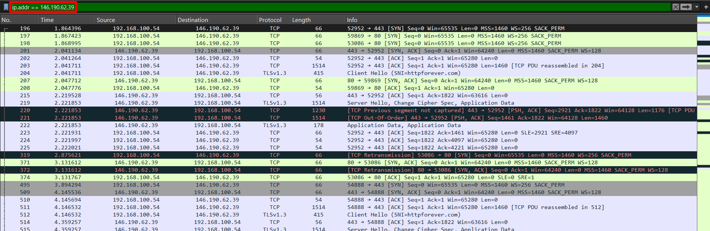


# 5. Understanding the Packet List Columns

The default columns are:

| Column | Meaning |
|---|---|
| **No.** | Sequential number Wireshark assigns to the packet within this capture. **NOT a property of the packet itself** — it's just "the 47th frame I saw." |
| **Time** | Seconds since capture started (by default). Format is configurable via **View → Time Display Format**. You can switch to: (a) `absolute clock time`, (b) `time-of-day` or (c) `delta-from-previous`. |
| **Source** | The "from" address of the packet. Wireshark picks the most informative one: usually the **IP address, but for ARP it'll be a MAC**, for IPX it'd be different. |
| **Destination** | The "to" address, same logic. |
| **Protocol** | The **highest-layer protocol** Wireshark could dissect. A packet carrying an HTTP GET will say `HTTP`, not `TCP` or `IP`, even though it contains all of those. |
| **Length** | Total frame length in **Bytes (B)** on the wire. |
| **Info** | Human-readable summary from the highest-layer dissector. For instance, `GET /index.html HTTP/1.1` for HTTP, `Standard query 0x1a2b A example.com` for DNS. |

## 5a. Things to try

- Click the **Time** column header → switch **View → Time Display Format → Time of Day**. Notice the column values change.
- Right-click any column header → **Column Preferences** → you can add columns like `src port`, `dst port`, TCP flags, etc. Very useful for recon.
- Right-click a field in the details pane → **Apply as Column** — that field becomes a new column in the packet list. Try it on `http.user_agent` after filtering for `http`.

## 5b. Verification Exercise
> Changed the time display format

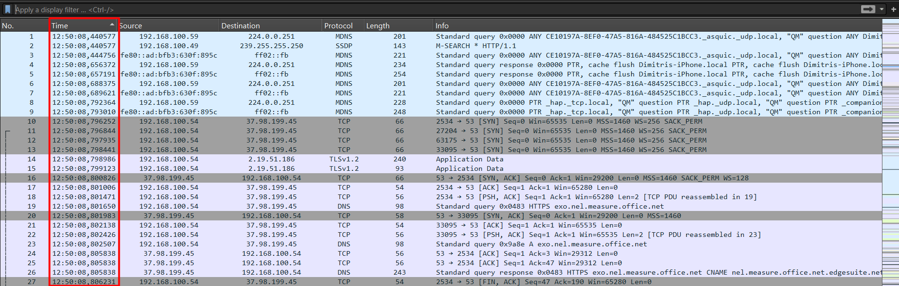


# 6. The Three Panes Explained

## 6a. Packet List Pane (top)

One line per packet. Selecting a line populates the other two panes.

## 6b. Packet Details Pane (middle)

A **tree** of protocol layers, **from outermost (physical/link layer) to innermost (application layer)**. For a typical HTTP packet over Wi-Fi you'd see something like:

```
> Frame 47: 512 bytes on wire, 512 bytes captured on interface ...    ← Physical Layer + Wireshark's metadata about the capture
> Ethernet II, Src: aa:bb:cc (...), Dst: dd:ee:ff (...)    ← Data Link Layer
> Internet Protocol Version 4, Src: A.B.C.D, Dst: E.F.G.H    ← Network Layer
> Transmission Control Protocol, Src Port: ..., Dst Port: ..., Seq: ..., Ack: ..., Len: ...    ← Transport Layer
> Hypertext Transfer Protocol    ← Application Layer
```

Click the `>` to expand each layer. Inside each, individual fields are themselves clickable. **Clicking highlights the corresponding bytes in the bottom pane.**

**Tip:** Right-click any field and click **`Prepare as Filter → Selected`** to build a display filter from that exact value. This is the **fastest way to learn the filter syntax**.

## 6c. Packet Bytes Pane (bottom)

Raw bytes in hex (left) and ASCII (right). Mostly useful when you want to **confirm something visually or look for cleartext strings** the dissector didn't surface as a named field.

## 6d. Verification Exercise
> Inspected an HTTP response of a web server to a `GET` request

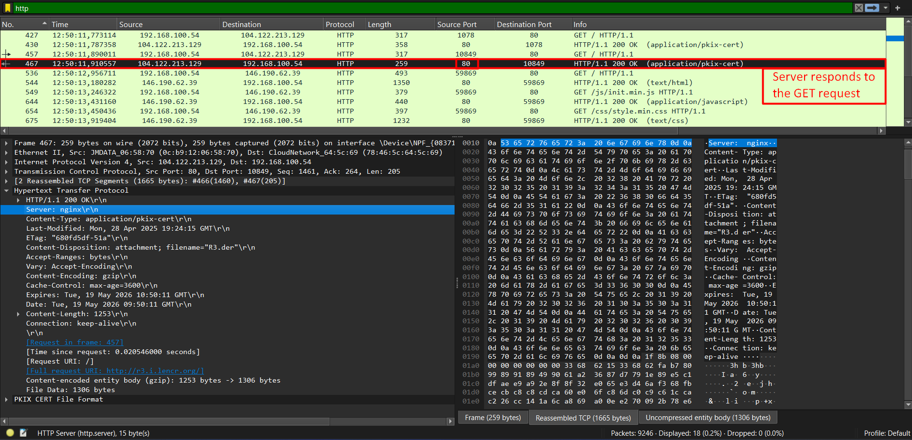


# 7. How Packets Split Into Protocols (Encapsulation)

Every packet is a stack of headers wrapped around a payload, like Russian nesting dolls. From outside in:

1. **Frame**: Wireshark metadata, not on the wire.
2. **Link Layer**: Usually Ethernet II on wired, or 802.11 on Wi-Fi *(often presented as Ethernet on Windows because of how Npcap delivers frames)*.
3. **Network Layer**: IPv4 or IPv6. This is where source/destination IP live.
4. **Transport Layer**: TCP, UDP, ICMP *(ICMP is technically network-layer but usually sits here in the tree)*.
5. **Application Layer**: HTTP, DNS, TLS, SMB, FTP, SSH, etc.

Wireshark dissects all visible layers automatically. The **`Protocol`** column shows the **topmost one** it could identify.

## 7a. Things to try

- Filter `dns` → click a query packet → expand the layers in the details pane. Notice: Ethernet → IPv4 → **UDP** → DNS. DNS uses UDP, not TCP, for normal queries.
- Filter `http` → click any packet → expand. Notice: Ethernet → IPv4 → **TCP** → HTTP. HTTP rides on TCP.
- Filter `arp` → notice there is no IP layer at all. ARP is link-layer adjacent and doesn't use IP.

## 7b. Verification Exercise
> Inspecting a DNS over TCP packet, showing all layers: Frame, Ethernet, Internet Protocol (IP), Transmission Control Protocol (TCP) and Domain Name System (DNS)

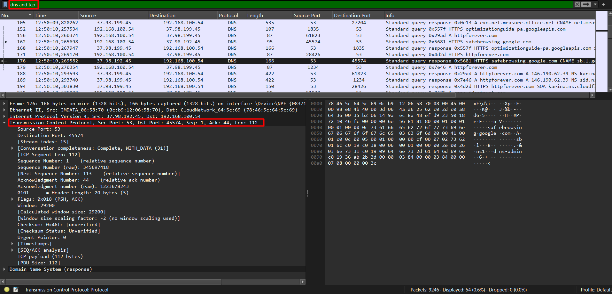

> HTTP Payload: Media

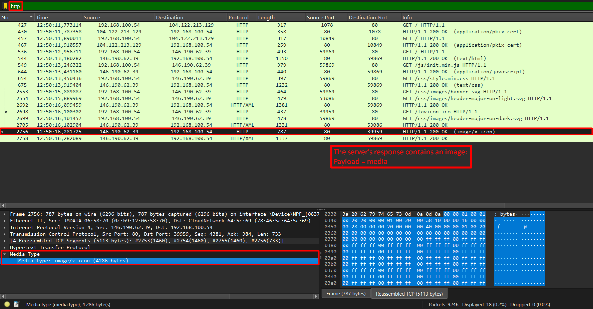


# 8. Capture Filters vs Display Filters

This trips up everyone at first. Wireshark has **two completely different filter systems**:

| | Capture Filter | Display Filter |
|---|---|---|
| **When applied** | Before packets are stored (at the Npcap driver level) | After capture, in the GUI |
| **Syntax** | BPF (Berkeley Packet Filter) | Wireshark's own language |
| **Example** | `host 192.168.1.1 and tcp port 80` | `ip.addr == 192.168.1.1 and tcp.port == 80` |
| **Where you type it** | Welcome screen, on the interface row, or **Capture → Options** | The green/red filter bar above the packet list |
| **Use when** | You want to limit what gets captured (high-volume networks, long captures) | You want to explore an existing capture |

**Recommendation for learning:** capture everything (no capture filter), then use display filters to slice the data. Display filters are far more powerful and you can change them freely without losing data.

## Verification Exercise

- Start a capture with **no** capture filter.
- In the display filter bar type `tcp.port == 443` and press Enter. The bar turns **green** for valid syntax (red = error, yellow = valid but suspicious).
- Try `tcp.port = 443` (one equals) → bar turns red, syntax error.
- Combine filters and use keywords.

> Double conditions

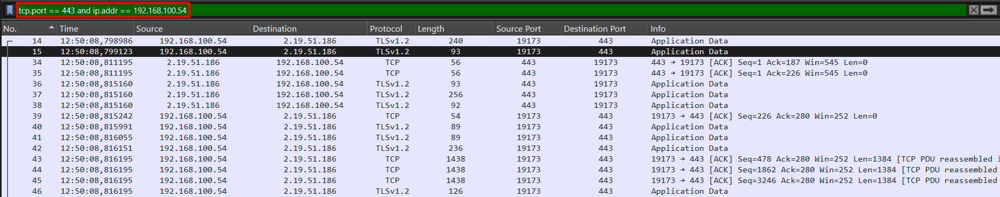

> Keyword `contains`
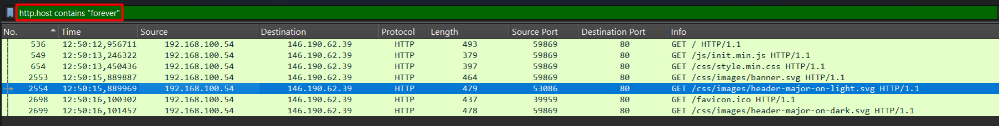


# 9. Display Filter Syntax and Common Variables

Display filters use the **`protocol.field`** notation, operators and boolean logic.

## 9a. Operators

| Operator | Meaning | Alternative |
|---|---|---|
| `==` | equals | `eq` |
| `!=` | not equals | `ne` |
| `>`, `<`, `>=`, `<=` | numeric comparisons | `gt`, `lt`, `ge`, `le` |
| `&&` | and | `and` |
| `\|\|` | or | `or` |
| `!` | not | `not` |
| `contains` | substring match | |
| `matches` | regex match | |

## 9b. Common filter variables

### 9b1. Addresses and Ports
```
ip.addr == 192.168.1.50          # Matches source IP OR destination IP
ip.src == 192.168.1.50           # Source IP only
ip.dst == 192.168.1.50           # Destination IP only
ipv6.addr == fe80::1
eth.addr == aa:bb:cc:dd:ee:ff    # MAC address
tcp.port == 443                  # Source port OR destination port
tcp.srcport == 443               # Source port only
tcp.dstport == 443               # Destination port only
udp.port == 53
```

### 9b2. Protocols
```
arp
dns
http
tls
icmp
dhcp
smb2
ssh
ftp
quic
```

### 9b3. Application-layer Fields
```
http.request.method == "GET"
http.host == "example.com"
http.user_agent contains "Mozilla"
http.response.code == 404
dns.qry.name contains "google"
dns.qry.type == 1                # A records
tls.handshake.extensions_server_name == "example.com"   # SNI — visible even in HTTPS
```

### 9b4. TCP flags and State
```
tcp.flags.syn == 1 and tcp.flags.ack == 0    # SYN, no ACK → connection initiation
tcp.analysis.retransmission                  # problem indicator
tcp.stream eq 5                              # all packets in TCP stream #5
```

### 9b5. Combining
```
ip.src == 192.168.1.50 and tcp.port == 443
http and !(ip.dst == 10.0.0.1)
dns and dns.qry.name contains "ads"
```

## 9c. Discovering Filter Names

You don't have to memorize all of them. **Right-click any field** in the packet details pane → **Apply as Filter → Selected** auto-generates a working filter using the exact correct field name. This is how most people learn the syntax — by reverse-engineering it from real packets.

Also useful: **Analyze → Display Filter Expression** opens a browser of every known field grouped by protocol.

## 9d. Verification Exercise

Run a fresh short capture, then try in order:
1. `arp` — should show ARP requests/replies on your LAN
2. `dns` — should show your DNS lookups
3. `tls.handshake.type == 1` — should show TLS "Client Hello" packets (the start of every HTTPS connection; the SNI field reveals which host you're connecting to even when the connection is encrypted)
4. `tcp.flags.syn == 1 and tcp.flags.ack == 0` — should show only connection-initiation packets

> Filter: Connection Initiation

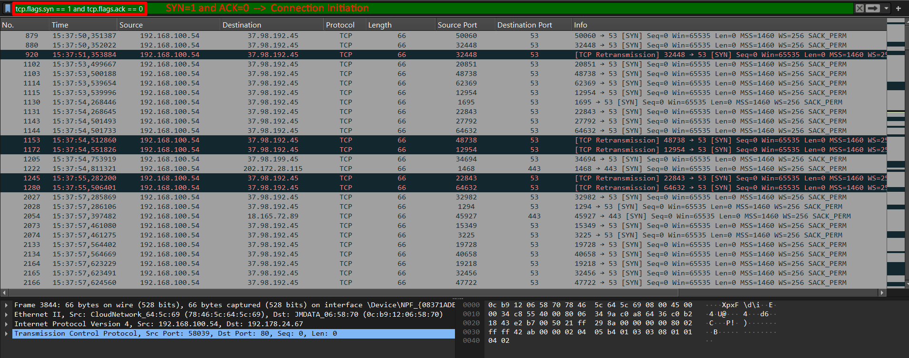

> Filter: CLIENT HELLO messages revealing SNI

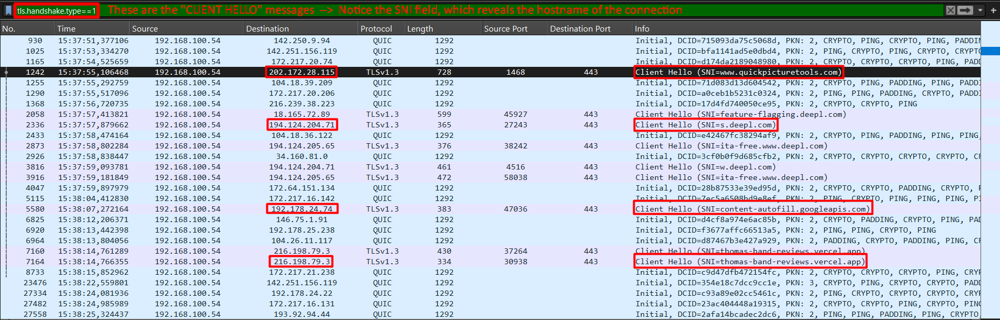

> Filter: DNS query name

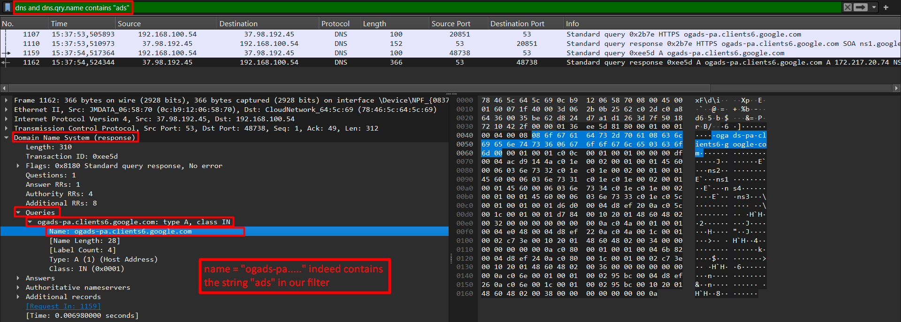


# 10. Following Streams and Conversations

A **stream** is a reassembled, ordered view of a single TCP/UDP/TLS conversation — the packets are put back together into the messages they originally formed.

## 10a. How to do it

1. Right-click any TCP or HTTP packet → **Follow → TCP Stream** (or HTTP Stream, or UDP Stream).
2. A new window opens showing the full conversation, with one side's data in red and the other in blue.
3. The packet list is automatically filtered to that stream (you'll see `tcp.stream eq N` in the filter bar). Clear the filter to return to all packets.

For HTTP, **Follow → HTTP Stream** is even cleaner — you see request headers and response bodies as a chat-style transcript.

## 10b. A **conversation** vs a **stream**

- A *stream* is **one TCP/UDP flow**.
- A *conversation* in Wireshark's vocabulary is the broader idea: **all traffic between two endpoints over time, possibly across many streams**. Find it under **`Statistics → Conversations`**.
- To follow an HTTP stream, filter `http`, right-click a GET and then `Follow → HTTP Stream`. You should see the raw HTTP request and response headers, plus the response body (HTML) in clear text if it's an unencrypted site.

## 10c. Verification Exercise
> TCP Stream

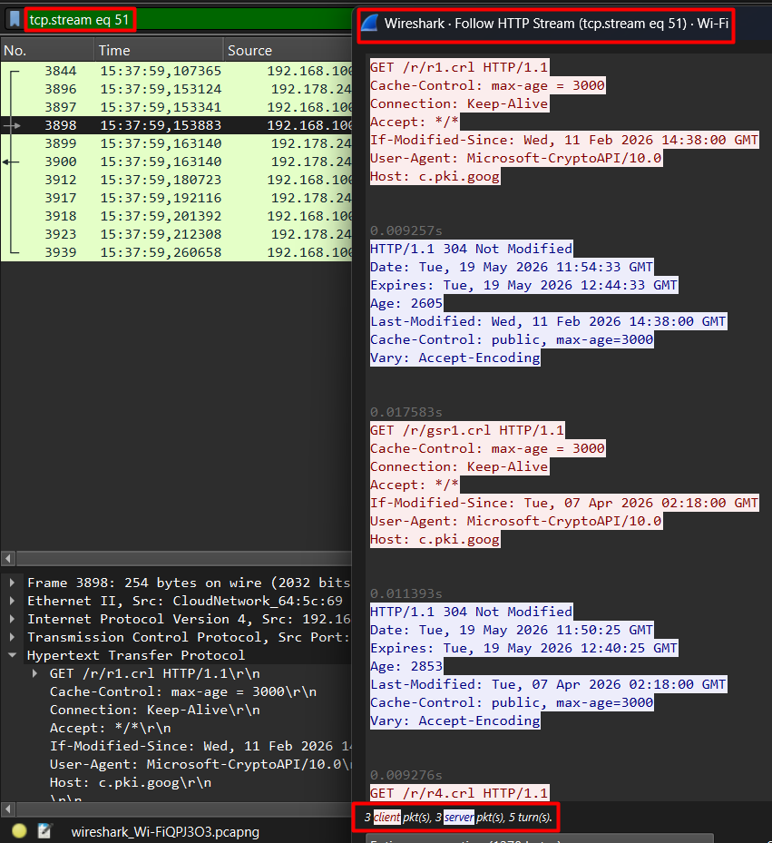

> TCP Conversation

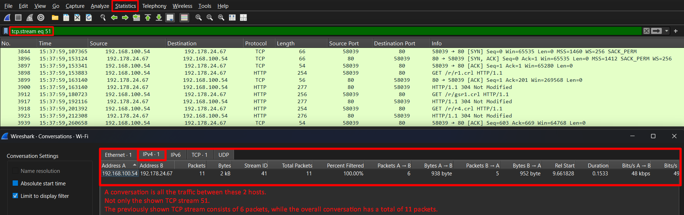


# 11. Statistics: The Recon Goldmine

For passive reconnaissance, the **Statistics** menu is arguably more valuable than the packet list itself. The most useful entries:

## 11a. `Statistics → Endpoints`

A table of every endpoint (IP address, MAC address, or port) that appeared in the capture, with packet/byte counts in each direction. Tick **"Limit to display filter"** to constrain to filtered traffic.

**Recon value:** instant host inventory of the local segment. Every device that made any noise during the capture appears here, often with hostname resolution if you enable **View → Name Resolution → Resolve Network Addresses**.

## 11b. `Statistics → Conversations`

Same idea, but pairs of endpoints. Shows who talked to whom and how much.

**Recon value:** reveals trust relationships and "hub" hosts (file servers, DNS resolvers, gateways) that lots of devices talk to.

## 11c. `Statistics → Protocol Hierarchy`

A nested breakdown of what percentage of bytes/packets belong to each protocol.

**Recon value:** tells you at a glance what's on the network. Heavy SMB? Probably a Windows file-sharing environment. Lots of mDNS/SSDP? Lots of consumer/IoT devices. Significant DNP3/Modbus? You're on an OT/industrial network.

## 11d. `Statistics → DHCP / DNS / HTTP / Resolved Addresses`

Each opens a protocol-specific summary. **Resolved Addresses** is particularly recon-useful: every IP that had a hostname identified (via DNS responses Wireshark saw, NetBIOS, mDNS, etc.) appears as a name↔IP mapping.

## 11e. Verification Exercise

- Run a 30-second capture with normal browsing activity.
- Open **Statistics → Protocol Hierarchy** — verify you see TCP and UDP both nonzero, and probably TLS, DNS, ARP at minimum.
- Open **Statistics → Endpoints**, IPv4 tab. Count how many distinct IPs you saw. Many will be CDN edges (Google, Akamai, Cloudflare) — that's normal.

> Statistics: Endpoints

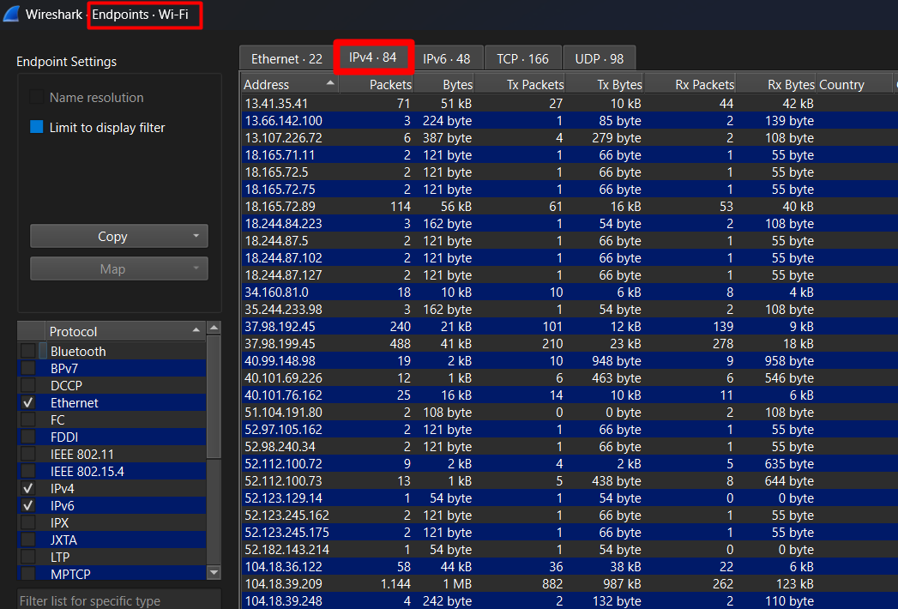

> Statistics: Conversations

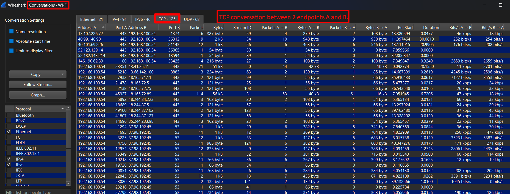

> Statistics: Protocol Hierarchy

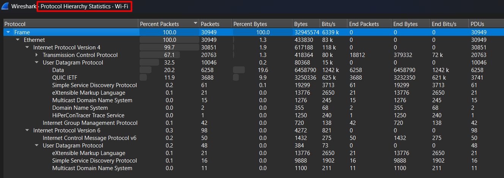

> Statistics: Resolved addresses

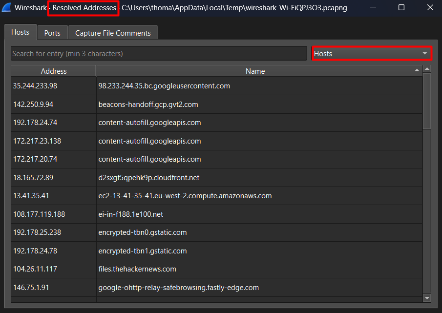


# 12. Coloring Rules and Profiles

## 12a. Coloring rules

The colored rows in the packet list aren't random. **`View → Coloring Rules`** shows the rule list — top match wins. In default settings, **TCP retransmissions are black-on-red, ARP is yellow**, etc. You can right-click a packet → **`Colorize Conversation`** to highlight all packets in that flow temporarily, useful when tracing a session through a noisy capture.

## 12b. Profiles

A **profile is a saved bundle of settings**: column layout, coloring rules, display filter favourites, preferences.
Go to **`Edit → Configuration Profiles`** lets you create separate ones. You can have one for general use and one for recon work with custom columns like User-Agent, Server, SNI.

**Recommendation:** as soon as you're comfortable, make a "Recon" profile with these extra columns:
- `tcp.srcport`
- `tcp.dstport`
- `tls.handshake.extensions_server_name` (SNI)
- `http.user_agent`
- `http.server`
- `dns.qry.name`

## 12c. Verification Exercise

> Default Coloring Rules

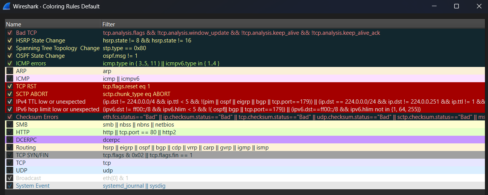

> New Profile with 3 added columns: `Source Port`, `Destination Port` and `Server Name`

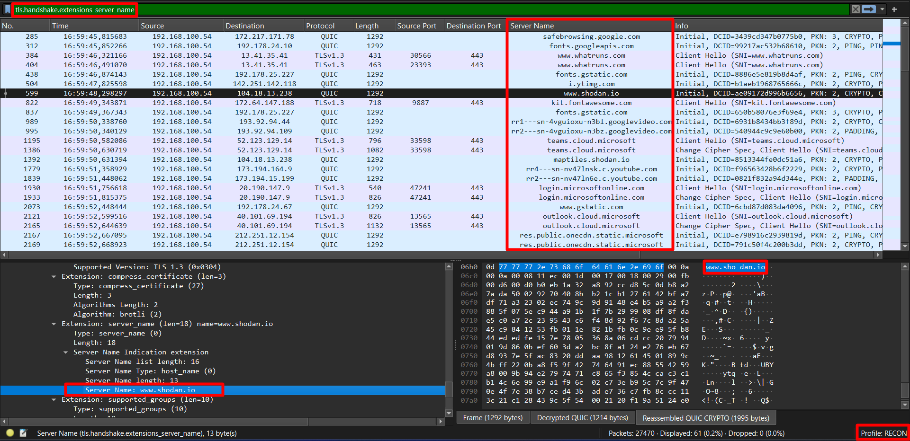


# 13. Saving, Exporting, and Re-opening Captures

- **File → Save As** → saves the full capture as `.pcapng` (modern format) or `.pcap` (older, more compatible).
- **File → Export Specified Packets** → save only what matches the current display filter. Useful for trimming huge captures down to the interesting bits.
- **File → Export Objects → HTTP / SMB / TFTP / etc.** → extracts files transferred over those protocols. (E.g., an HTTP download of an image becomes a recoverable PNG.)
- **File → Open** → opens any `.pcap` or `.pcapng`, including ones produced by tcpdump, tshark, or NetworkMiner.

**For your project:** save short, well-labelled captures with descriptive filenames. They become the input to tshark, NetworkMiner, and p0f later.

> 💡 `.pcapng` is the default and supports per-packet annotations and multiple interfaces. Use it unless you need to share with an older tool that only reads `.pcap`.


# 14. Common Gotchas on Windows 11

- **Wi-Fi captures show only your own traffic** → Windows Wi-Fi adapters typically *don't support real promiscuous/monitor mode*. You see your own frames + broadcasts/multicasts *but not your neighbour's unicast*. This is a Windows + driver limitation, not a Wireshark bug. For full LAN visibility later you'll want *a wired connection, a managed switch with port mirroring, or a network tap*.
- **Captures fill RAM fast on busy networks** → use **Capture → Options → Output** to ring-buffer to disk (e.g., rotate every 100 MB, keep last 10 files).
- **Some packets show as "Malformed"** → usually means the dissector got something it didn't expect; rarely a problem for learning.
- **"Decryption failed" on TLS** → expected. You *can't read TLS without keys*, but you *can still see SNI*, certificate details (during handshake), and timing.
- **No interfaces shown** → Npcap not installed or not loaded. Re-run installer, reboot.


# Recon-Oriented Exercises

Do these in order. Each one teaches a concrete skill you'll use later.

## Exercise 1: Inventory your own machine's "voice"

1. Close all browsers and chatty apps.
2. Start a capture for 60 seconds. Just sit there.
3. Open **Statistics → Conversations**, IPv4 tab.
4. Identify every IP your machine talked to. How many were there? Look up a few unknowns in WHOIS/Shodan **later** (we want passive only for now). 
5. What does this tell you about background telemetry on a "quiet" Windows install?

✅ Verification: you should see at least a few conversations with Microsoft, your router, your DNS server, and possibly NTP servers.

> Conversations window from quiet-capture exercise

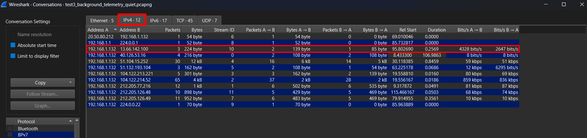

## Exercise 2: Map your local network

1. Start a capture for 2-3 minutes.
2. Apply display filter: `arp or (icmp and icmp.type == 0) or mdns or nbns or dhcp`
3. **Statistics → Endpoints → IPv4** — every local IP that broadcast anything will appear.
4. Also check **Statistics → Resolved Addresses** for hostnames.

✅ Verification: you should discover at least your router, your own machine, and (if you have any) printers, smart-home devices, phones. Each often has a hostname revealed by mDNS or NetBIOS.

*Note*: Regarding the router, we may not be able to find its IP (e.g., `192.168.1.1`) at the `Endpoints > IPv4/6` table, when filtering with `arp`. This IP may appear in the `Info` column, but this information is retrieved by looking at the **payload of the ARP packet**! ARP is not carried inside IP (no network layer at all). **Wireshark builds the `IPv4/6` table by counting only the packets that have an IPv4/6 header**. Since ARP packets do not have such a header, the IPs mentioned inside the ARP payloads will not "make" it into this tab. And this is also the reason why we can see the MAC address of the router in the `Ethernet` tab, but not its IP in the `IPv4/6` tabs.

> Filtering with `arp or mdns` shows only router's MAC, not its IPv4/6

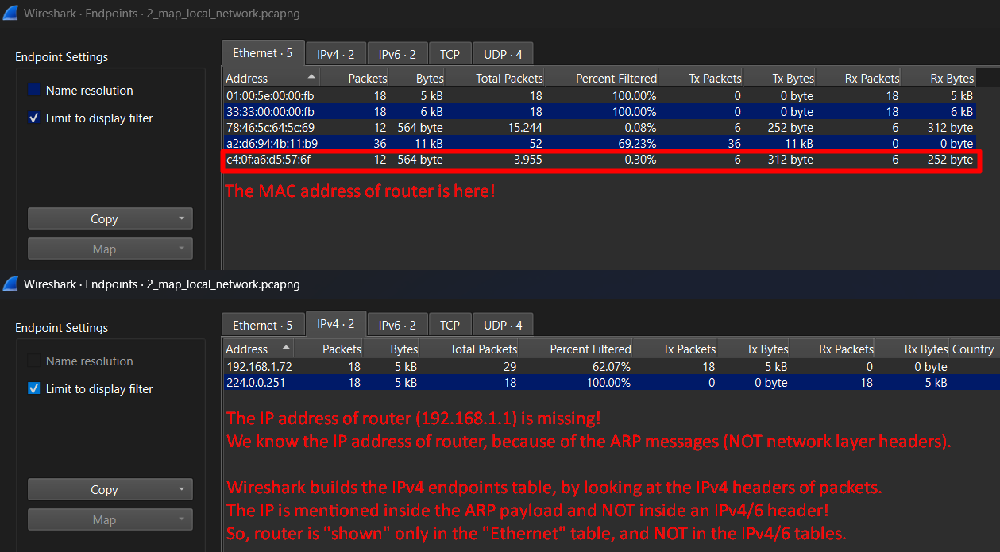

> Filtering with `dns` shows both the router's MAC and its IPv4/6

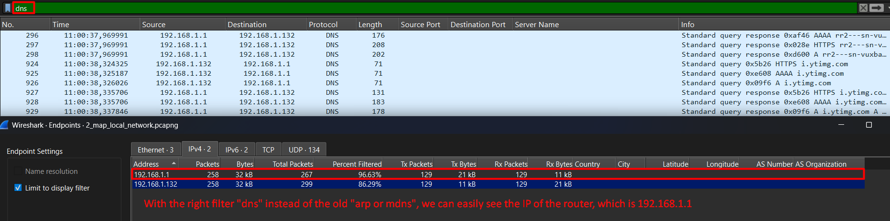

## Exercise 3: Identify HTTPS destinations without decrypting

1. Capture for a minute while you visit 3-4 different HTTPS websites.
2. Apply filter: `tls.handshake.type == 1`
3. Add a column for `tls.handshake.extensions_server_name`.

✅ Verification: every TLS Client Hello reveals the destination hostname in the SNI field, even though the payload is encrypted. This is a core passive-recon insight: HTTPS protects content but not destination.

> HTTP Destinations (CLIENT HELLO messages included)

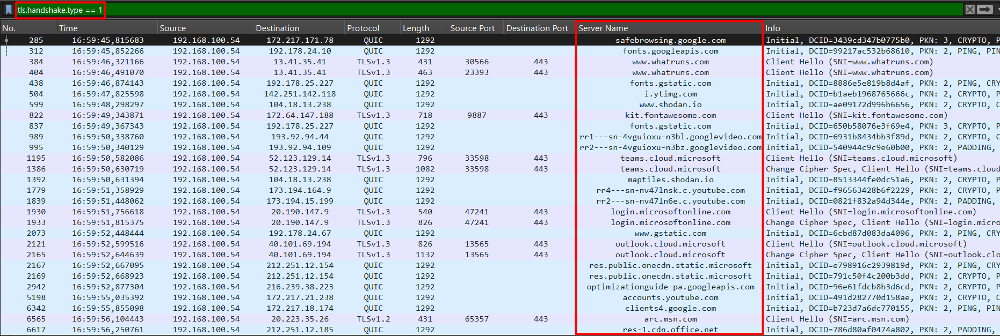


## Exercise 4: Find a banner

1. In your browser, visit a plain HTTP page (`http://httpforever.com/` works).
2. Filter: `http.response`
3. Add column for `http.server`.

✅ Verification: the Server header reveals the web-server software and sometimes version (e.g., `nginx/1.18.0`). This is a textbook banner-grab — done entirely passively because you used a normal browser request.

> Banner in `http.response`

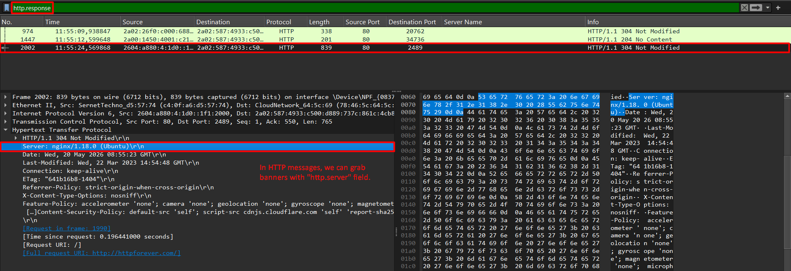

## Exercise 5: Passive OS hints

1. Capture some traffic from another device on your network (you'll see at least broadcast/multicast from it).
2. Filter on that device: `ip.src == <its-IP> or arp.src.proto_ipv4 == <its-IP>`
3. Look at the TCP options in any SYN packet (details pane → TCP → Options). The combination of MSS, window scale, and TCP options ordering is a fingerprint that p0f uses for OS identification.

✅ Verification: you don't need to identify the OS by hand — the exercise is to see that the *information needed to do so* is sitting there in normal traffic.


# Cheat Sheet

## Top 10 Display Filters for recon

```
arp                                              # Local hosts via ARP
dhcp                                             # Hostnames + MACs from DHCP requests
mdns or nbns                                     # Local name broadcasts
dns                                              # DNS queries

tls.handshake.type == 1                          # HTTPS destinations (SNI) and CLIENT HELLO messages
http.request                                     # HTTP requests + User-Agent
http.response                                    # HTTP responses + Server banner

tcp.flags.syn == 1 and tcp.flags.ack == 0        # Connection initiations
ip.addr == <target>                              # All traffic to/from a host
tcp.port == 22 or tcp.port == 3389               # SSH and RDP
```

## Top Keyboard Shortcuts

| Shortcut | Action |
|---|---|
| `Ctrl + E` | Start/stop capture |
| `Ctrl + R` | Restart capture |
| `Ctrl + F` | Find packet |
| `Ctrl + G` | Go to packet number |
| `Ctrl + /` | Focus the display filter bar |
| `Ctrl + Space` | Apply selected field as column |
| `Ctrl + Shift + C` | Copy selected field value |

## Recon-useful Columns to add

- `tcp.srcport` / `tcp.dstport`
<!-- - `tls.handshake.extensions_server_name`http -->
- `http.user_agent`
- `http.server`
- `dns.qry.name`
